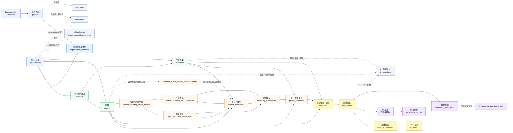

# 当前数据库产品链路结构示意图

数据来源：`supabase/migrations/*.sql`，整理时间：2026-06-09。

这不是完整物理 ERD，而是面向产品理解的数据库链接图：保留核心业务主链路、关键外键关系、派生视图和横切能力，省略部分枚举、索引、RLS policy 和审计触发器细节。

## 1. 产品主链路

## 2. 核心表群关系

```mermaid
erDiagram
  auth_users ||--|| profiles : "id"
  organizations ||--o{ organization_members : "organization_id"
  profiles ||--o{ organization_members : "user_id"

  organizations ||--o{ suppliers : "organization_id"
  organizations ||--o{ projects : "organization_id"
  organizations ||--o{ streamers : "organization_id"
  suppliers ||--o{ projects : "supplier_id"
  suppliers ||--o{ streamers : "primary_supplier_id"
  streamers ||--o{ streamer_accounts : "streamer_id"
  streamers ||--o{ streamer_suppliers : "streamer_id"
  suppliers ||--o{ streamer_suppliers : "supplier_id"

  projects ||--o{ project_applications : "project_id"
  streamers ||--o{ project_applications : "streamer_id"
  project_applications ||--o{ recording_submissions : "application_id"
  projects ||--o{ project_streamers : "project_id"
  streamers ||--o{ project_streamers : "streamer_id"

  projects ||--o{ live_tasks : "project_id"
  streamers ||--o{ live_tasks : "streamer_id"
  live_tasks ||--o{ live_reports : "live_task_id"
  live_reports ||--o{ report_screenshots : "live_report_id"
  report_screenshots ||--o{ ocr_results : "screenshot_id"
  live_reports ||--o{ report_change_logs : "live_report_id"
  live_reports ||--o{ review_samples : "live_report_id"

  projects ||--o{ settlement_batches : "project_id"
  settlement_batches ||--o{ settlement_batch_items : "settlement_batch_id"
  live_reports ||--o{ settlement_batch_items : "live_report_id"
  streamers ||--o{ settlement_batch_items : "streamer_id"

  projects ||--o{ project_recording_share_boards : "project_id"
  project_recording_share_boards ||--o{ project_recording_share_items : "share_board_id"
  project_applications ||--o{ project_recording_share_items : "application_id"
  recording_submissions ||--o{ project_recording_share_items : "recording_submission_id"
  project_recording_share_boards ||--o{ project_recording_vendor_reviews : "share_board_id"
  project_applications ||--o{ project_recording_vendor_reviews : "application_id"
  recording_submissions ||--o{ project_recording_vendor_reviews : "recording_submission_id"

  billing_plans ||--o{ organization_subscriptions : "plan_id"
  organizations ||--o{ organization_subscriptions : "organization_id"
  organizations ||--o{ usage_events : "organization_id"
  organizations ||--o{ usage_monthly_counters : "organization_id"
  organizations ||--o{ usage_addons : "organization_id"
  organizations ||--o{ feature_addons : "organization_id"

  organizations ||--o{ ai_invocations : "organization_id"
  ai_invocations ||--o{ ai_tool_invocations : "ai_invocation_id"
  ai_invocations ||--o{ background_jobs : "ai_invocation_id"
  ai_invocations ||--o{ project_reviews : "ai_invocation_id"
  ai_invocations ||--o{ ai_diagnoses : "ai_invocation_id"
  ai_invocations ||--o{ ai_script_versions : "ai_invocation_id"
  streamers ||--o{ streamer_metrics : "streamer_id"
  suppliers ||--o{ supplier_scores : "supplier_id"

  organizations ||--o{ audit_logs : "organization_id"
  organizations ||--o{ notifications : "organization_id"
```

## 3. 读图要点

- `organizations` 是多租户根节点，绝大多数业务表都带 `organization_id`，配合 RLS 做租户隔离。
- `projects + streamers` 是业务主轴：先通过 `project_applications` 和 `recording_submissions` 完成准入，再落到 `project_streamers`，之后才能排班、报数、结算。
- `live_reports` 是证据与结算的连接点：截图、OCR、审核日志、抽检样本、结算明细都从报数记录向外展开。
- `project_recording_share_*` 是项目级录屏外部审核链路，链接到报名和录屏，不新建独立厂商门户数据源。
- `streamer_payable_items_safe` 与 `streamer_public_project_announcements` 是对主播侧暴露的安全读模型，用视图/RPC 控制字段和状态转换。
- `ai_invocations` 是 AI/OCR/诊断/复盘相关能力的调用账本，和项目、主播、供应商等业务对象通过结果表或来源字段建立关联。
- `billing_plans / organization_subscriptions / usage_*` 是 SaaS 化门控层，不直接改变主业务链路，但会影响 AI、OCR、导出等能力额度。
