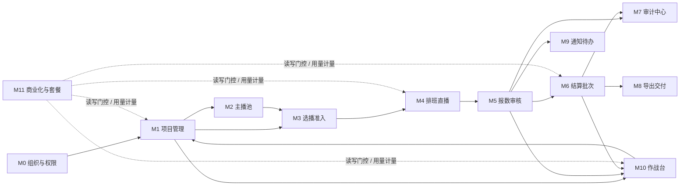

# 经营舱产品功能文档

日期：2026-06-05
最近更新：2026-06-16
范围：当前仓库内已经实现和已有规格沉淀的产品能力
优先级：先说明产品逻辑，再列模块、接口、数据和验收证据

## 1. 产品定位

经营舱是面向游戏直播 MCN、直播工作室、主播运营团队的项目经营系统。它把“接单、立项、选主播、排班、直播、报数、审核、结算、复盘、商业化计费”放在同一条受权限、审计、证据和套餐门控保护的业务链路里。

系统不是单纯的 CRM，也不是单纯的排班工具。它的核心价值是把直播项目经营里最容易断裂的几件事闭合起来：

| 问题                                     | 产品解法                                                                                     |
| ---------------------------------------- | -------------------------------------------------------------------------------------------- |
| 项目、主播、报数、结算分散在表格和群聊里 | 以项目为主线串联准入、排班、报数、结算和复盘                                                 |
| 主播报数可信度不稳定                     | 系统计时、截图时长、主播填报三轨证据冻结                                                     |
| 审核通过后容易漏结或重复结               | 只用已审核入池报数生成结算批次，并记录已结批次                                               |
| 游戏直播成本规则散落在线下表格           | 规划项目级复杂成本规则，把 CPA/CPS、礼物、投流、供应商、补播和扣罚归集到规则、结算和导出链路 |
| 财务字段容易误暴露给主播或供应商         | 后端 DTO、安全视图和 AI masking 层共同过滤敏感字段                                           |
| 高风险操作缺少追溯                       | 统一审计、append-only 日志、原因必填和通知                                                   |
| 运营经验无法沉淀                         | 作战台、报价测算、主播匹配、供应商评分、复盘报告、AI 诊断形成经营飞轮                        |
| SaaS 化上线后成本难控                    | 套餐权益、用量计量、加量包、欠费只读和账单状态 API                                           |

## 2. 一句话逻辑

```text
组织建好权限
  -> 创建并发布项目
  -> 主播报名或运营邀约
  -> 录屏审核和最终入项
  -> 排班直播并系统计时
  -> 主播提交报数和证据
  -> 运营审核报数
  -> 审核通过进入结算池
  -> 生成应付/应收结算批次
  -> 财务确认、锁定、必要时重开
  -> 导出、交付、通知、审计
  -> 作战台复盘和下一轮定价/选播
  -> 套餐与用量持续门控
```

## 3. 当前产品闭环



当前主线从 P0 骨架推进到 P5 商业化底座。P1/P2 黄金路径、P3 治理、P4 决策飞轮、P5 商业化均已有回归测试入口。P6 正式收费上线方案已有规格文档，但真实支付、发票、对账、退款等仍属于后续范围。

## 4. 产品对象模型

| 对象                            | 业务含义                   | 上游                   | 下游                             |
| ------------------------------- | -------------------------- | ---------------------- | -------------------------------- |
| Organization                    | MCN / 工作室租户           | 注册、后台初始化       | 成员、项目、主播、账单           |
| Profile                         | 用户资料                   | Supabase Auth          | 组织成员、主播绑定               |
| Organization Member             | 组织内员工或主播账号角色   | 组织管理               | 权限、审计、通知                 |
| Supplier                        | 主播供应商或渠道           | 组织主数据             | 主播、项目、评分                 |
| Project                         | 一次游戏直播项目或交付单元 | 运营立项               | 招募、排班、报数、结算、复盘     |
| Streamer                        | 主播档案                   | 主播池                 | 报名、任务、报数、结算、安全账单 |
| Streamer Account                | 主播平台账号               | 主播档案               | 画像、匹配、诊断                 |
| Project Application             | 主播报名或邀约记录         | 项目、主播             | 录屏审核、最终入项               |
| Recording Submission            | 选播录屏证据               | 报名/邀约              | 审核、主播录屏库                 |
| Project Streamer                | 主播加入项目后的关系       | 录屏通过和最终确认     | 排班、结算规则快照               |
| Live Task                       | 一场直播任务或排班         | 已入项主播             | 开播、下播、报数                 |
| Live Report                     | 主播对直播任务的报数       | 直播任务               | 审核、结算池、复盘               |
| Report Screenshot / OCR Result  | 报数证据和 OCR 结果        | 报数提交               | 证据等级、AI/OCR 用量            |
| Settlement Pool                 | 已审核待结算报数集合       | live_reports           | 结算批次                         |
| Settlement Batch                | 应收或应付批次             | 结算池                 | 财务确认、锁定、导出             |
| Settlement Batch Item           | 批次明细                   | 结算批次、人工承载     | 主播安全账单、财务明细           |
| Complex Cost Rule Entitlement   | 项目级复杂成本规则开通状态 | 套餐、加购、销售特批   | 项目规则配置、额度计量           |
| Cost Rule Template              | 游戏直播成本规则模板       | 系统模板、组织模板     | 成本预估、项目规则版本           |
| Project Cost Rule Version       | 项目成本规则版本           | 模板、人工配置         | 结算快照、成本预览、审计         |
| Project Cost Item               | 项目成本明细               | 系统计算、导入、人工   | 结算批次、毛利看板、导出包       |
| Cost Import Batch               | 成本数据导入批次           | CPA/CPS/礼物/投流文件  | 待确认成本项、导入审计           |
| Audit Log                       | 操作审计                   | 所有写动作             | 审计中心、AI rollout 统计        |
| Notification                    | 通知和待办                 | 任务、审核、结算、异常 | 通知中心、顶部铃铛               |
| Export Job                      | 受控导出结果               | 导出中心               | CSV、交付包、审计                |
| Billing Plan / Subscription     | 套餐与订阅                 | 商业化后台             | 权益、只读模式、用量             |
| Usage Event / Counter           | 用量事件和月计数           | OCR、AI、导出、存储等  | 套餐额度、加量包                 |
| AI Invocation / Tool Invocation | AI 调用账本                | AI 工具层              | 成本、审计、安全追踪             |

## 5. 用户和权限逻辑

### 5.1 角色

| 角色              | 产品定位                                                                        |
| ----------------- | ------------------------------------------------------------------------------- |
| owner             | 组织拥有者，拥有最高业务和权限管理能力                                          |
| ops_manager       | 运营负责人，可发布项目、管理准入、排班、审核和大部分结算动作                    |
| operator_business | 一线运营，可创建项目草稿、维护项目、邀约/审核/排班/报数审核，部分高风险动作受限 |
| finance           | 财务角色，以读取财务和结算信息为主，P2 写入侧保持只读边界                       |
| streamer          | 主播，只能访问自己的任务、报数、录屏、诊断和安全结算信息                        |

### 5.2 关键权限矩阵

| 能力                 | owner      | ops_manager           | operator_business | finance       | streamer             |
| -------------------- | ---------- | --------------------- | ----------------- | ------------- | -------------------- |
| 创建项目草稿         | 是         | 是                    | 是                | 否            | 否                   |
| 发布项目             | 是         | 是                    | 否                | 否            | 否                   |
| 修改项目基础字段     | 是         | 是                    | 是                | 否            | 否                   |
| 修改项目默认结算规则 | 是，需原因 | 是，需原因            | 否                | 否            | 否                   |
| 查看组织成员         | 是         | 是                    | 否                | 否            | 否                   |
| 管理组织成员         | 是         | 否                    | 否                | 否            | 否                   |
| 创建成员账号         | 所有角色   | ops/operator/streamer | streamer          | 否            | 否                   |
| 修改主播风险         | 是，需原因 | 是，需原因            | 否                | 否            | 否                   |
| 邀约/审核准入        | 是         | 是                    | 是                | 否            | 否                   |
| 最终确认主播加入     | 是         | 是                    | 否                | 否            | 否                   |
| 创建/取消排班        | 是         | 是                    | 是                | 否            | 否                   |
| 开播/下播            | 可代操作   | 可代操作              | 可代操作          | 否            | 仅自己的任务         |
| 审核报数             | 是         | 是                    | 是                | 否            | 否                   |
| 查看结算池           | 是         | 是                    | 是                | 是            | 否                   |
| 生成结算批次         | 是         | 是                    | 是                | 否            | 否                   |
| 锁定结算批次         | 是，需原因 | 是，需原因            | 否                | 否            | 否                   |
| 重开锁定批次         | 是，需原因 | 否                    | 否                | 否            | 否                   |
| 查看财务敏感字段     | 是         | 依模块门控            | 依模块门控        | 是            | 否                   |
| 查看主播安全账单     | 否         | 否                    | 否                | 否            | 仅自己的应付安全视图 |
| 运行主播诊断         | 可         | 可                    | 可                | 可按 AI scope | 仅主播安全输入/输出  |

权限不是只靠前端按钮隐藏。系统同时使用三层边界：

1. 数据库 RLS：所有业务表按 `organization_id`、项目访问函数和主播绑定函数隔离。
2. 服务层 RBAC：每个写动作在 TypeScript 服务里二次判断角色、状态和原因。
3. 前端门控：页面按钮和模块入口按角色与业务状态展示。

## 6. 三端产品入口

| 端             | 路由                      | 用户     | 产品任务                       |
| -------------- | ------------------------- | -------- | ------------------------------ |
| 经营 Web       | `/console`                | MCN 员工 | 作战台总览、模块导航           |
| 项目列表       | `/console/projects`       | MCN 员工 | 项目草稿、发布、项目卡片       |
| 经营模块页     | `/console/stubs/[module]` | MCN 员工 | M0-M11 模块化经营工作台        |
| 登录页         | `/login`                  | MCN 员工 | 经营后台登录                   |
| 主播移动端任务 | `/m/tasks`                | 主播     | 今日任务、开播、下播、报数     |
| 主播移动端录屏 | `/m/recordings`           | 主播     | 提交录屏链接、查看审核状态     |
| 主播移动端诊断 | `/m/diagnosis`            | 主播     | AI 卡点诊断                    |
| 主播移动端我的 | `/m/me`                   | 主播     | 个人信息、收益摘要入口         |
| 主播移动端登录 | `/m/login`                | 主播     | 主播端登录                     |
| 主播桌面端     | `/desktop`                | 主播     | 桌面任务、录屏、AI、收益、档案 |

经营 Web 的模块导航：

| 模块 | 名称         | Route key     | 目标                             |
| ---- | ------------ | ------------- | -------------------------------- |
| M0   | 组织与权限   | org           | 组织成员、角色、子账号、权限边界 |
| M1   | 项目管理     | projects      | 项目全生命周期                   |
| M2   | 主播池       | streamers     | 主播档案、风险、匹配指标         |
| M3   | 选播准入     | admission     | 报名、邀约、录屏审核、入项确认   |
| M4   | 排班直播     | tasks         | 排班、开播、下播、异常           |
| M5   | 报数审核     | reports       | 证据审核、入池判断               |
| M6   | 结算批次     | settle        | 结算池、批次、人工承载、锁定     |
| M7   | 审计中心     | audit         | 审计日志查询                     |
| M8   | 导出交付     | export        | 受控导出、厂家交付包             |
| M9   | 通知待办     | notifications | 待办、通知状态                   |
| M10  | 作战台       | warroom       | 报价、匹配、复盘、AI 经营建议    |
| M11  | 商业化与套餐 | billing       | 套餐、权益、用量、只读状态       |

### 6.1 角色化默认看板

`/console` 不再只被理解为所有 MCN 员工共用的一张总看板。登录后应根据账号类型进入对应默认首页，同一套业务指标在后端保持统一口径，再由角色化 DTO 投影出不同字段、队列和动作。

| 账号类型 | 现有角色或访问范围 | 默认看板目标 | 第一屏重点 |
| -------- | ------------------ | ------------ | ---------- |
| 老板 / 负责人 | `owner` | 判断经营是否健康、盈利是否安全、风险是否受控 | 进行中项目、本月厂家应收、预估毛利和毛利率、低/负毛利项目、高风险事项 |
| 运营负责人 | `ops_manager` | 判断哪些项目卡住、团队今天先处理什么 | 招募/执行/结算项目数、主播缺口、录屏待审、今日排班、异常任务 |
| 一线运营 | `operator_business` | 只看自己负责项目今天要处理的动作 | 我的今日任务、未开播、待报数、待审核报数、需要联系主播事项 |
| 财务 | `finance` | 判断哪些钱可以安全结算、哪些金额有风险 | 可结算池金额、可结算报数、待生成批次、本月主播应付、弱证据/人工承载金额 |
| 主播 | `streamer` | 完成任务、补证据、查看安全收益状态 | 今日任务、待上传截图、审核中报数、待补充事项、可结算/已结算收益 |
| 协作 MCN | 协作协议范围 | 处理本组织参与项目的贡献、异常和分账 | 协作项目、已加入主播、协作直播时长、通过报数、待确认分账 |
| 外部厂家 / 客户 | 分享链接或交付包范围 | 审核候选和验收交付，不接触内部财务 | 候选主播、待审核录屏、已通过候选、交付场次、交付包状态 |

通用规则：

- 看板只给经营判断和跳转上下文，不直接执行高风险动作。
- 每个指标必须能回到项目、主播、任务、报数、结算、审计或导出记录。
- 隐藏字段必须在服务端 DTO 层剥离，不能只靠前端隐藏。
- 主播、协作方和厂家不接收 MCN 毛利、供应商内部成本、其他主播结算、内部风险备注和私密审计细节。

## 7. 核心状态机

### 7.1 项目状态

| 状态          | 含义                | 可流转到                             |
| ------------- | ------------------- | ------------------------------------ |
| draft         | 草稿，尚未正式招募  | recruiting, archived                 |
| recruiting    | 招募中，可报名/邀约 | pending_start, active, paused, ended |
| pending_start | 已招募待开播        | active, paused, ended                |
| active        | 进行中              | paused, ended                        |
| paused        | 暂停中              | active, ended                        |
| ended         | 已结束              | settling, archived                   |
| settling      | 结算中              | archived, ended                      |
| archived      | 已归档              | 无                                   |

产品规则：

- 发布项目只能由 owner / ops_manager 执行。
- 草稿发布时要求合法状态流转，当前主路径是 `draft -> recruiting`。
- 结算规则变更属于高风险操作，必须填写原因并写入审计。
- `active -> settling` 非法，必须先结束项目再进入结算。

### 7.2 报名/邀约状态

| 状态                | 含义                         | 可流转到                                                     |
| ------------------- | ---------------------------- | ------------------------------------------------------------ |
| submitted           | 主播报名已提交               | recording_required, recording_reviewing, withdrawn           |
| invited             | 运营定向邀约已创建           | recording_required, recording_reviewing, declined, withdrawn |
| recording_required  | 需要录屏                     | recording_reviewing, withdrawn                               |
| recording_reviewing | 录屏审核中                   | recording_approved, recording_rejected, recording_required   |
| recording_approved  | 录屏通过，等待最终确认       | joined, declined                                             |
| recording_rejected  | 录屏驳回                     | recording_reviewing, withdrawn                               |
| confirmed           | 已确认但仍需补录屏或终态处理 | recording_required, recording_reviewing, declined            |
| joined              | 已加入项目                   | withdrawn                                                    |
| declined            | 未加入                       | 无                                                           |
| withdrawn           | 主播撤回                     | 无                                                           |

产品规则：

- 主播报名要求项目 `openSignup=true`。
- 运营邀约要求项目 `allowDirectInvite=true`。
- 黑名单主播不能报名或被邀约。
- 如果项目强制录屏，报名/邀约不会直接入项，必须提交录屏并通过审核。
- 录屏通过只进入 `recording_approved`，仍需 owner / ops_manager 最终确认。
- 最终确认会创建 `project_streamers`，同时冻结该主播在项目中的结算规则快照。

### 7.3 录屏审核状态

| 状态          | 含义       |
| ------------- | ---------- |
| submitted     | 主播已提交 |
| reviewing     | 审核中     |
| approved      | 审核通过   |
| rejected      | 审核拒绝   |
| needs_changes | 需要修改   |

录屏提交支持私有文件路径和外链双轨，必须至少有 `storagePath` 或 `externalUrl`。录屏版本号按同一 application 的最新版本递增。

### 7.4 直播任务状态

| 状态                  | 含义             | 可流转到                                         |
| --------------------- | ---------------- | ------------------------------------------------ |
| pending_live          | 待开播           | live, cancelled, abnormal                        |
| live                  | 直播中           | pending_report, cancelled, abnormal              |
| pending_report        | 待报数           | report_pending_review, cancelled, abnormal       |
| report_pending_review | 报数待审         | report_approved, report_rejected, abnormal       |
| report_approved       | 报数通过         | completed                                        |
| completed             | 已完成           | 无                                               |
| report_rejected       | 报数被拒或需补充 | pending_report, report_pending_review, cancelled |
| cancelled             | 已取消           | 无                                               |
| abnormal              | 异常             | pending_live, live, pending_report, cancelled    |

产品规则：

- 只有 `project_streamers.status = joined` 的主播可以被排班。
- 员工可创建单个或批量任务；主播只能操作自己的任务。
- 开播写入 `systemStartedAt` 并置为 `live`。
- 下播要求存在系统开播时间，写入 `systemStoppedAt` 和 `systemDuration`。
- 下播时间不能早于开播时间。
- 报数必须从直播任务进入，不能绕过任务直接创建。

### 7.5 报数状态

| 状态                 | 含义        |
| -------------------- | ----------- |
| pending              | 初始待处理  |
| ocr_ing              | OCR 识别中  |
| pending_confirm      | 待主播确认  |
| pending_review       | 待运营审核  |
| pending_adjudication | 待复核/裁决 |
| approved             | 审核通过    |
| rejected             | 审核拒绝    |
| need_more            | 需要补充    |
| voided               | 作废        |

审核决策：

| 决策      | 报数结果    | 任务结果                       |
| --------- | ----------- | ------------------------------ |
| approve   | `approved`  | `report_approved -> completed` |
| reject    | `rejected`  | `report_rejected`              |
| need_more | `need_more` | `report_rejected`              |

审核通过默认会设置：

- `includeInTaskResult=true`
- `enterSettlementPool=true`

这两个字段是后续“项目结果统计”和“结算池消费”的关键交接点。

### 7.6 证据等级和结算时长

系统在报数创建时冻结证据快照：

| 优先级 | 输入                                     | 结算时长来源     | 证据等级 |
| ------ | ---------------------------------------- | ---------------- | -------- |
| 1      | 有系统时长且有截图时长，二者差异在阈值内 | system           | green    |
| 2      | 有系统时长但无截图时长                   | system           | yellow   |
| 3      | 有系统时长但与截图时长差异超阈值         | system           | yellow   |
| 4      | 无系统时长但有截图时长                   | screenshot       | yellow   |
| 5      | 无系统/截图，只有主播填报                | claimed          | red      |
| 6      | 三者都没有                               | 报错，不允许提交 |

默认差异阈值：

- 百分比阈值：10%
- 绝对分钟阈值：15 分钟
- 实际允许差异：`max(systemDuration * 10%, 15 minutes)`

风险标记：

| 风险标记                    | 触发条件                   |
| --------------------------- | -------------------------- |
| missing_screenshot_duration | 缺少截图时长               |
| duration_divergence         | 系统时长与截图时长差异过大 |
| missing_system_duration     | 缺少系统时长               |

### 7.7 结算批次状态

| 状态      | 含义   |
| --------- | ------ |
| draft     | 草稿   |
| generated | 已生成 |
| pending   | 待确认 |
| confirmed | 已确认 |
| locked    | 已锁定 |
| reopened  | 已重开 |
| voided    | 作废   |

产品规则：

- 结算池只读取 `status=approved`、`enter_settlement_pool=true` 且未被对应批次类型消费的报数。
- 应付批次使用 `project_streamers` 中冻结的单主播结算规则。
- 应收批次使用项目默认结算规则。
- 一个报数可以被应收和应付两类批次分别消费，但不能在同一批次类型重复消费。
- 锁定批次需要 owner / ops_manager，并且必须填写原因。
- 重开锁定批次只有 owner 可以执行，并且必须填写原因。
- 手动金额变更必须填写原因，写高风险审计。

### 7.8 通知状态

| 状态    | 含义   |
| ------- | ------ |
| unread  | 未读   |
| read    | 已读   |
| handled | 已处理 |
| ignored | 已忽略 |

通知由任务、审核、结算、异常扫描等模块写入。用户只能更新自己可见通知的状态，每次更新写审计。

### 7.9 订阅状态

| 状态      | 产品效果                   |
| --------- | -------------------------- |
| trialing  | 试用，可按当前套餐权益访问 |
| active    | 正常订阅                   |
| past_due  | 欠费，只读模式             |
| readonly  | 管理后台设置的只读模式     |
| cancelled | 已取消，只读模式           |

`past_due`、`readonly`、`cancelled` 会进入 read-only 模式。读动作可以继续，写动作被套餐门控拒绝，不删除历史结算或审计数据。

## 8. 核心业务流程

### 8.1 M0 组织与权限

目标：让 MCN 有一个明确的组织边界、成员身份和角色权限。

主要功能：

- 读取组织成员列表。
- 邀请成员加入组织。
- 创建子账号，生成默认登录账号和临时密码。
- 创建成员时按创建者角色限制可创建的目标角色。
- 更新成员角色，必须 owner 操作并填写原因。
- 更新成员状态，必须 owner 操作并填写原因。
- owner 不能把自己的 owner 角色改掉，也不能暂停自己的账号。
- 历史演示成员会在服务层过滤，不进入真实成员列表。

输入和输出：

| 输入                           | 输出                      |
| ------------------------------ | ------------------------- |
| 成员邮箱、姓名、角色、创建模式 | organization_members 记录 |
| 子账号模式下的临时密码         | 返回一次性 credentials    |
| 角色/状态变更原因              | 高风险 audit_logs         |

### 8.2 M1 项目管理

目标：把客户/厂家机会转成可运营、可招募、可结算的项目。

主要功能：

- 创建项目草稿。
- 发布项目进入招募。
- 更新项目基础信息：名称、时间、开放报名、定向邀约、是否强制录屏、是否强制系统计时、厂家/产品/代理/供应商信息、描述。
- 更新项目默认结算规则：结算方式、时薪、底薪、规则 JSON。
- 项目卡片 DTO 显示状态、结算方式、系统计时、发布时间、风险等级和指标占位。

关键规则：

- `operator_business` 可以创建和编辑草稿，但不能发布项目。
- 发布只允许 owner / ops_manager。
- 结算规则变更高风险，必须原因。
- 项目状态机阻止非法跳转。

### 8.3 M2 主播池

目标：沉淀主播档案、平台账号、风险状态和可匹配指标。

主要功能：

- 创建主播档案，可不绑定登录账号。
- 维护实名、性别、来源、品类、平台、风格、默认结算方式。
- 读取主播池列表和主播桌面档案 DTO。
- 统计近 90 天录屏、任务、报数、项目贡献，生成 matchScore、趋势、项目贡献。
- 更新主播风险状态。
- 黑名单主播不能被邀约或报名。
- 主播录屏链接库支持主播提交产品、品类、URL、月份，后台可审核。

关键规则：

- 风险状态只有 owner / ops_manager 可改。
- 风险状态变更必须写原因和高风险审计。
- 主播端展示的档案不会暴露银行卡等敏感字段，结算银行卡显示为“不向前端暴露”。

### 8.4 M3 选播准入

目标：让主播从报名/邀约变成项目内可排班成员，同时留下录屏和审核证据。

主要路径：

```text
主播报名 / 运营邀约
  -> 创建 project_applications
  -> 如果需要录屏：提交 recording_submissions
  -> 运营审核录屏：approved / rejected / needs_changes
  -> 录屏通过后 owner / ops_manager 最终确认
  -> 创建 project_streamers(joined)
  -> 冻结单主播结算规则快照
```

主要功能：

- 主播自助报名。
- 员工定向邀约。
- 主播提交选播录屏。
- 员工审核录屏。
- 最终确认加入。
- 最终拒绝并记录原因。
- 经营端读取准入队列。
- 主播端读取自己的报名卡片。

关键规则：

- 报名只允许 streamer 角色。
- 邀约和录屏审核允许 owner / ops_manager / operator_business。
- 最终入项只允许 owner / ops_manager。
- 录屏审核通过不等于入项。
- 拒绝最终入项必须填写原因。
- 审核和入项决策均写审计并发通知。

### 8.5 M4 排班直播

目标：把已入项主播安排到具体直播任务，并捕获系统计时。

主要功能：

- 创建单个直播任务。
- 批量创建直播任务。
- 取消任务。
- 开始直播，写系统开始时间。
- 停止直播，写系统结束时间并计算系统时长。
- 员工和主播都可操作任务，但主播只能操作自己的任务。
- 前端 DTO 支持经营端任务看板和主播端任务卡片。

关键规则：

- 只能给 joined 的项目主播排班。
- 排班结束时间不能早于开始时间。
- 下播必须有开播时间。
- 任务状态驱动后续报数，不允许绕过任务。

### 8.6 M5 报数审核

目标：让直播结果变成可审核、可结算、可复盘的证据快照。

主要功能：

- 从 live task 提交 report。
- 保存系统时长、截图时长、主播填报时长。
- 冻结结算时长、证据来源、证据等级、差异百分比和风险标记。
- 可上传报数截图并保存截图 hash。
- 运营审核报数：通过、拒绝、需要补充。
- 报数变更写 report_change_logs。
- 审核通过默认进入结算池。

关键规则：

- 报数只能从 `pending_report` 或 `report_rejected` 任务提交。
- 审核只允许 owner / ops_manager / operator_business。
- 审核阶段不算钱，只决定是否入池。
- 结算金额由 M6 在批次生成时计算。

### 8.7 M6 结算批次

目标：把已审核报数转换成可追溯的应收/应付批次。

主要功能：

- 读取结算池。
- 生成应付批次。
- 生成应收批次。
- 生成批次明细。
- 添加 CPA/CPS/礼物/手工金额承载项。
- 在复杂成本规则开通后，承载任务奖金、扣罚、补播、供应商费用、平台费、投流和游戏资产成本。
- 锁定批次。
- 重开已锁定批次。
- 主播端读取安全应付账单。
- 经营端读取批次列表、详情、结算池预览。

结算计算规则：

| 结算方式        | 系统自动金额                           | 说明                                            |
| --------------- | -------------------------------------- | ----------------------------------------------- |
| cpt             | `settlementDuration / 60 * hourlyRate` | 仅当 evidence=green 且 timeSource=system 时计算 |
| base_salary     | baseSalary                             | 每主播每批次只应用一次                          |
| base_salary_cpt | baseSalary + CPT                       | 底薪每主播每批次一次，CPT 同上                  |
| cpa             | 0                                      | 仅人工承载                                      |
| cps             | 0                                      | 仅人工承载                                      |
| gift            | 0                                      | 仅人工承载                                      |
| manual          | 0                                      | 仅人工承载                                      |

复杂成本规则补充：

- 复杂成本规则是项目级增强能力，不替代基础结算。
- 未开通复杂规则时，只开放基础结算和基础人工调整。
- 开通后可配置 CPA、CPS、礼物分成、任务奖金、扣罚、补播、供应商费用、投流、平台费、样品/CDK、税费和发票成本。
- 系统只自动计算证据强且规则确定的 CPT、底薪和底薪 + CPT。
- CPA、CPS、礼物、投流和供应商账单先通过导入或人工确认进入成本项。
- 成本规则变更只影响后续规则版本和后续结算，不静默改写历史批次。

安全规则：

- 主播端读取 `streamer_payable_items_safe` 安全视图。
- 主播端不返回厂家应收、毛利、供应商成本、内部风险备注。
- finance 在 P2 写入边界上保持只读。
- 批次锁定和重开均为高风险审计。

### 8.8 M7 审计中心

目标：把系统里的关键操作做成可查询、不可随意篡改的证据。

主要功能：

- 按模块、动作、项目、主播、对象、时间读取审计日志。
- 高风险动作保存原因。
- 审计日志 append-only，数据库触发器阻止更新/删除。
- 变更前后快照记录在 `before` / `after`。
- 审计中心按组织和项目权限过滤。

高风险动作示例：

- 项目结算规则变更。
- 主播风险/黑名单变更。
- 结算手动金额变更。
- 结算批次锁定。
- 结算批次重开。
- 组织成员角色/状态变更。

### 8.9 M8 导出交付

目标：让运营可以导出交付数据，但不越过敏感字段边界。

主要功能：

- 受控 CSV 导出。
- 导出字段按 kind 定义白名单。
- 导出动作写审计。
- 厂家交付包只输出公开字段。
- 报数明细、项目执行、结算批次、审计日志有各自字段集合。
- 复杂成本规则开通后，可导出主播付款表、供应商对账表、项目成本明细、项目毛利复盘和异常调整审计表。

导出种类：

| kind               | 用途         | 敏感策略               |
| ------------------ | ------------ | ---------------------- |
| vendor_delivery    | 厂家交付包   | 只允许 public 字段     |
| project_execution  | 项目执行数据 | 内部字段可见           |
| report_details     | 报数明细     | 不带财务敏感字段       |
| settlement_batch   | 结算批次     | 财务字段按角色过滤     |
| project_costs      | 项目成本明细 | 内部成本字段按角色过滤 |
| supplier_reconcile | 供应商对账表 | 仅协作范围内字段       |
| audit_logs         | 审计日志     | 内部审计字段           |

### 8.10 M9 通知待办

目标：让任务、审核、结算、异常形成待办闭环。

主要功能：

- 读取通知中心列表。
- 读取我的待办。
- 未读、已读、已处理、已忽略状态流转。
- 异常扫描去重发送通知。
- 顶部铃铛读取未读数。

通知来源示例：

- 新项目报名。
- 录屏待审。
- 录屏通过需最终确认。
- 新直播任务。
- 报数待审。
- 报数审核结果。
- 结算批次生成。
- 高风险结算动作。
- 异常扫描。

### 8.11 M10 作战台和 AI 经营飞轮

目标：把履约和结算数据转成下一轮经营决策。

主要功能：

- 角色化默认看板：owner、ops_manager、operator_business、finance 先作为员工端 MVP；streamer、协作 MCN、厂家/客户作为后续作用域化入口。
- 报价测算。
- 游戏直播复杂成本和毛利测算。
- 主播匹配排序。
- 供应商质量评分。
- 项目复盘报告。
- 自动审核 shadow / active 评估。
- AI 经营分析、选播建议、脚本优化、报价权衡、主播诊断、M10 Copilot。
- AI 调用账本和工具调用账本。
- OpenAI / Hunyuan / deterministic provider registry 和 gateway。

角色化看板指标族：

| 指标族 | 业务问题 | 典型来源 |
| ------ | -------- | -------- |
| 项目健康 | 项目是否按计划推进、是否存在延期或亏损风险 | `projects`、`project_streamers`、`live_tasks`、`live_reports`、`settlement_batches` |
| 招募与准入 | 主播供给是否卡住、录屏和最终入项是否积压 | `project_applications`、`recording_submissions`、`project_recording_share_*` |
| 直播执行 | 今日排班是否正常、是否有未开播/未报数/异常任务 | `live_tasks`、`task_anomalies`、`notifications` |
| 报数证据 | 报数能否入池、证据是否足够强 | `live_reports`、OCR 作业、AI 调用账本 |
| 结算毛利 | 哪些金额可结算、哪些金额存在弱证据或人工承载风险 | `settlement_batches`、`settlement_batch_items`、`live_reports`、`project_streamers` |
| 协作分账 | 协作方贡献和分账是否待确认 | `project_collaboration_*`、协作结算记录 |
| 治理风险 | 高风险动作、敏感导出和异常待办是否受控 | `audit_logs`、`notifications`、受控导出记录 |

角色化默认布局：

| 账号类型 | KPI 区 | 队列区 | 风险区 | 默认跳转 |
| -------- | ------ | ------ | ------ | -------- |
| owner | 项目数、应收、毛利、低毛利项目、高风险事项 | 项目经营排行 | 低/负毛利、延期、敏感导出、批次重开 | 项目复盘、毛利分析、审计、结算批次 |
| ops_manager | 项目状态、主播缺口、录屏待审、今日排班、异常任务 | 项目卡点队列、准入漏斗、今日执行盘 | 超时卡点、未处理异常、录屏/入项积压 | 录屏审核、最终入项、异常分派、项目详情 |
| operator_business | 我的今日任务、未开播、待报数、待审核、需联系主播 | 时间线待办、报数审核、主播提醒 | 未开播、未停止、截图缺失、证据偏差 | 任务详情、报数审核、通知上下文 |
| finance | 可结算池、报数条数、待生成批次、主播应付、弱证据金额 | 可结算池、批次状态、财务导出 | 红/黄证据、人工调整、规则变更、重开批次 | 结算池、批次详情、导出中心、审计 |

报价测算输出：

| 字段                        | 含义         |
| --------------------------- | ------------ |
| estimatedDurationMinutes    | 预估总时长   |
| expectedReceivableCents     | 预期应收     |
| streamerPayableCents        | 主播应付     |
| supplierCostCents           | 供应商成本   |
| platformFeeCents            | 平台费       |
| grossMarginCents            | 毛利         |
| marginRateBps               | 毛利率 bps   |
| breakEvenQuoteCents         | 保本报价     |
| suggestedMinimumQuoteCents  | 建议最低报价 |
| recommendedSettlementMethod | 建议结算方式 |
| riskNotes                   | 风险标记     |

复杂成本测算输入：

| 输入项               | 用途                                   |
| -------------------- | -------------------------------------- |
| 主播数量和预计时长   | 预估 CPT、底薪和补播成本               |
| CPA 行为数和单价     | 预估拉新、预约、注册、首充类成本       |
| CPS 销售额和分成比例 | 预估充值、道具销售、小游戏推广分成     |
| 礼物流水和分成比例   | 预估礼物分成和平台费                   |
| 供应商费用           | 预估外部 MCN、招募服务商和内容服务成本 |
| 投流预算             | 预估项目真实毛利                       |
| 游戏资产费用         | 预估 CDK、账号、道具、样品等履约成本   |

主播匹配逻辑：

- 品类匹配加分。
- 平台匹配加分。
- 风格匹配加分。
- 完成率、选播通过率、ROI、毛利贡献加分。
- 可用时长不足、争议、近期异常、黑名单扣分。
- 有风险时建议偏保底，无风险且高 ROI/完成率/通过率时建议底薪 + CPT。

供应商评分逻辑：

- 选播通过率、完成率、毛利贡献加分。
- 异常率、黑名单率、供应商黑名单扣分。
- 输出 A/B/C/D 等级和风险备注。

项目复盘逻辑：

- 计算总时长、总观看、应收、应付、供应商成本、毛利、毛利率。
- 识别最佳/最差主播。
- 统计异常和争议。
- 输出是否继续、下一轮报价建议和推荐动作。

自动审核八类门禁：

| 门禁              | 规则                               |
| ----------------- | ---------------------------------- |
| 状态              | report 必须是 pending_review       |
| 证据              | 必须 green + system                |
| 风险标记          | 不能有 riskFlags                   |
| 任务异常          | 任务不能有异常                     |
| 时长覆盖          | 不能被人工覆盖                     |
| 主播信任          | 必须 trusted                       |
| 项目敏感度        | high sensitive 不自动过            |
| 时长上限/计划偏差 | 不能超过日硬上限，不能偏离计划阈值 |

自动审核 rollout 逻辑：

- shadow 模式默认安全，只写影子决策审计。
- gray / active 必须满足 kill switch、样本数、false accept rate、抽检错误率等门禁。
- active 必须显式请求，且通过 rollout gate。
- active 审核也只把报数置为审核通过并入池，不直接计算钱。

AI 安全规则：

- AI 工具全部 read-only。
- 工具按 scope 匹配角色。
- 工具调用和 AI 调用均写账本。
- 主播角色输出会剥离 `receivableCents`、`grossMarginCents`、`supplierCostCents`、`vendorReceivableCents`、`internalRiskNotes` 等字段。
- AgentOutput 必须包含 facts、findings、caveats、recommendations。
- recommendations 必须 `requiresHumanApproval=true`，不能包含可执行动作。
- 含数字的结论必须有 fact source 支撑。

### 8.12 M11 商业化与套餐

目标：为 SaaS 化提供套餐、权益、用量和欠费只读底座。

当前已实现：

- 套餐层级：free / basic / pro / enterprise。
- 订阅状态：trialing / active / past_due / readonly / cancelled。
- 权益键：project_management、settlement、export_center、war_room、auto_review_shadow、auto_review_active、ai_diagnosis、vendor_portal、private_deployment。
- feature add-on 可额外打开权益。
- 用量指标：active_streamer、seat、ocr、ai、storage_mb、export。
- 用量状态计算：套餐额度 + 加量包 - 已用量。
- 用量采用 soft overage，不在 P5 直接 hard block。
- 账单状态 API 输出安全的套餐、权益和用量。
- 欠费/只读/取消阻止写动作，但保留读和历史数据。

P6 正式商业化规格已沉淀：

- 自助试用、选套餐、在线付款、续费、升级、用量包。
- 发票申请、财务后台人工开票、发票状态流。
- 聚合支付接微信/支付宝。
- 订单、交易、webhook、订阅周期、对账、发票请求等新表。
- Billing Guard 全量覆盖核心写路由。

这些是后续上线能力，不应混同为当前 P5 已落地范围。

复杂成本规则商业化规划：

- 能力名称：游戏直播业务成本复杂规则。
- 商业定位：作为“复杂结算规则”的项目级增强能力销售。
- 开通方式：套餐内置、功能加购、销售特批三种。
- 建议价格：99 元/项目/月，990 元/项目/年。
- 专业版：赠送 5 个复杂规则项目额度/月，超出后按项目加购。
- 经营版、企业版：默认开放，可继续扩展专属规则、API 对接和企业导出。
- 额度口径：项目当月启用复杂规则即消耗 1 个项目额度，关闭不返还当月额度。

### 8.13 X1 游戏直播复杂成本规则（MVP 已交付）

目标：把游戏直播项目中分散在线下表格、群聊和供应商账单里的成本规则收进系统，形成“规则配置 -> 成本预估 -> 执行归集 -> 结算确认 -> 导出交付 -> 毛利复盘”的闭环。

能力范围：

- 项目级复杂规则开关和套餐额度计量。
- 游戏直播规则模板：CPT、底薪 + CPT、CPA、CPS、礼物分成、供应商协作、投流毛利、补播扣罚。
- 项目成本规则版本，支持草稿、生效、归档。
- 项目成本项，区分 system、import、manual 来源。
- CPA、CPS、礼物、投流、供应商账单导入和待确认。
- 成本和毛利看板，提示低毛利、负毛利、高平台费、证据不足。
- 结算批次追加复杂成本项。
- 导出主播付款表、供应商对账表、项目成本明细、项目毛利复盘和异常审计表。

成本类型：

| 类型                     | 处理方式                           |
| ------------------------ | ---------------------------------- |
| CPT、底薪、底薪 + CPT    | 沿用现有自动计算边界               |
| CPA、CPS、礼物分成       | 导入或人工确认后进入成本项         |
| 任务奖金、扣罚、补播     | 规则预估 + 人工复核                |
| 供应商服务费、协作分成   | 项目或协作范围内归集               |
| 平台抽佣、投流、游戏资产 | 进入项目毛利测算，不直接暴露给主播 |
| 审核、人工服务、税费发票 | 用于经营成本和毛利口径             |

交付边界：

- MVP 已交付项目级权益门控、规则版本、成本预览、成本导入确认、结算批次成本项附件、角色安全导出和经营端入口。
- MVP 不做全平台 GMV 自动抓取，不做自动扣罚，不做自然语言合同解析。
- 先把项目级开通、规则配置、成本预览、导入确认、结算承载和导出包打通。
- 自动化必须遵守“强证据自动算，弱证据人工承载”的结算原则。

## 9. 横向安全和治理边界

### 9.1 多租户隔离

- 所有业务表带 `organization_id`。
- RLS 使用 `is_org_member`、`current_user_role`、`is_mcn_staff`、`current_streamer_id`、`can_access_project` 等函数。
- MCN 员工按组织和项目访问。
- 主播按绑定的 streamer id 访问自己的数据。

### 9.2 字段级脱敏

| 场景         | 保护方式                               |
| ------------ | -------------------------------------- |
| 主播结算账单 | `streamer_payable_items_safe` 安全视图 |
| 主播 DTO     | 不返回应收、毛利、成本、内部风险       |
| 厂家交付包   | 只导出公开字段                         |
| AI 工具      | streamerForbiddenKeys 递归过滤         |
| 导出中心     | 字段白名单和 sensitivity 过滤          |

### 9.3 审计不可变

- `audit_logs` 有 append-only 触发器。
- 高风险审计要求 reason。
- 所有共享写服务统一调用 `writeAuditLog`。
- 导出、通知更新、AI 查询、异常扫描也写审计。

### 9.4 证据快照不可变

`live_reports` 在写入时冻结以下字段：

- `settlement_duration`
- `time_source`
- `evidence_level`
- `divergence_pct`
- `risk_flags`

数据库触发器阻止这些快照字段被后续静默改写。

### 9.5 真实数据原则

- 源码不随 seed 写入演示账号或业务样例数据。
- 本地验收数据应通过 Supabase Auth / 后台流程创建。
- smoke 测试通过 `.env.local` 中的 `SMOKE_*` 指向真实流程产生的数据。

## 10. API 总表

### 10.1 组织与账号

| API                                   | 方法  | 功能                                 |
| ------------------------------------- | ----- | ------------------------------------ |
| `/api/organization/members`           | GET   | 读取组织成员、组织信息和当前角色权限 |
| `/api/organization/members`           | POST  | 邀请成员或创建子账号                 |
| `/api/organization/members/:memberId` | PATCH | 更新成员角色或状态                   |

### 10.2 项目和主播池

| API                                | 方法  | 功能                       |
| ---------------------------------- | ----- | -------------------------- |
| `/api/projects`                    | GET   | 读取项目列表               |
| `/api/projects`                    | POST  | 创建项目草稿               |
| `/api/projects/:projectId`         | PATCH | 更新项目基础字段或结算规则 |
| `/api/projects/:projectId/publish` | POST  | 发布项目                   |
| `/api/streamers`                   | GET   | 读取主播池                 |
| `/api/streamers`                   | POST  | 创建主播档案               |
| `/api/streamers/:streamerId/risk`  | PATCH | 更新主播风险               |
| `/api/streamer/profile`            | GET   | 主播读取自己的档案         |

### 10.3 选播准入和录屏

| API                                             | 方法  | 功能                   |
| ----------------------------------------------- | ----- | ---------------------- |
| `/api/applications`                             | GET   | 经营端读取准入队列     |
| `/api/projects/:projectId/applications`         | POST  | 主播报名               |
| `/api/projects/:projectId/invitations`          | POST  | 员工邀约主播           |
| `/api/applications/:applicationId/videos`       | POST  | 主播提交选播录屏       |
| `/api/applications/:applicationId/review`       | PATCH | 员工审核录屏           |
| `/api/applications/:applicationId/confirm-join` | POST  | 最终确认入项           |
| `/api/applications/:applicationId/reject-join`  | POST  | 最终拒绝入项           |
| `/api/streamer/applications`                    | GET   | 主播读取自己的报名卡片 |
| `/api/streamer/recordings`                      | GET   | 主播读取录屏链接库     |
| `/api/streamer/recordings`                      | POST  | 主播提交录屏链接       |
| `/api/uploads/signed`                           | POST  | 创建私有上传签名 URL   |

### 10.4 排班、报数、OCR

| API                                  | 方法  | 功能                   |
| ------------------------------------ | ----- | ---------------------- |
| `/api/live-tasks`                    | GET   | 经营端读取直播任务     |
| `/api/live-tasks`                    | POST  | 创建单个直播任务       |
| `/api/live-tasks/batch`              | POST  | 批量创建直播任务       |
| `/api/live-tasks/:taskId/start`      | POST  | 开播                   |
| `/api/live-tasks/:taskId/stop`       | POST  | 下播                   |
| `/api/live-tasks/:taskId/cancel`     | POST  | 取消任务               |
| `/api/live-tasks/:taskId/reports`    | POST  | 提交报数               |
| `/api/live-reports`                  | GET   | 经营端读取报数审核队列 |
| `/api/live-reports/:reportId/review` | PATCH | 审核报数               |
| `/api/streamer/live-tasks`           | GET   | 主播读取自己的任务     |
| `/api/ocr/jobs`                      | GET   | 读取 OCR job 列表      |
| `/api/ocr/jobs`                      | POST  | 创建 OCR job           |
| `/api/ocr/jobs/:jobId`               | GET   | 读取 OCR job           |
| `/api/ocr/jobs/:jobId`               | POST  | 重试或执行 OCR job     |

### 10.5 结算

| API                                             | 方法 | 功能                 |
| ----------------------------------------------- | ---- | -------------------- |
| `/api/settlement-pool`                          | GET  | 读取结算池           |
| `/api/settlement-batches`                       | GET  | 读取结算批次列表     |
| `/api/settlement-batches`                       | POST | 生成结算批次         |
| `/api/settlement-batches/:batchId`              | GET  | 读取批次详情         |
| `/api/settlement-batches/:batchId/manual-items` | POST | 添加人工承载项       |
| `/api/settlement-batches/:batchId/cost-items`   | POST | 追加复杂成本项       |
| `/api/settlement-batches/:batchId/lock`         | POST | 锁定批次             |
| `/api/settlement-batches/:batchId/reopen`       | POST | 重开批次             |
| `/api/streamer/settlements`                     | GET  | 主播读取安全应付账单 |

### 10.6 治理、导出、通知

| API                                  | 方法  | 功能                 |
| ------------------------------------ | ----- | -------------------- |
| `/api/audit-logs`                    | GET   | 读取审计日志         |
| `/api/notifications`                 | GET   | 读取通知中心         |
| `/api/notifications/:notificationId` | PATCH | 更新通知状态         |
| `/api/anomalies/scan`                | POST  | 扫描直播异常并发通知 |
| `/api/exports`                       | POST  | 创建受控导出         |
| `/api/delivery-packages`             | GET   | 读取厂家交付包       |

### 10.7 作战台、自动审核、AI

| API                                | 方法 | 功能                  |
| ---------------------------------- | ---- | --------------------- |
| `/api/dashboards/role-home`        | GET  | 读取当前账号角色化看板 |
| `/api/war-room/pricing`            | POST | 报价测算              |
| `/api/war-room/matching`           | POST | 主播匹配和供应商评分  |
| `/api/war-room/project-review`     | POST | 项目复盘报告          |
| `/api/auto-review/evaluate`        | POST | 自动审核评估          |
| `/api/auto-review/rollout-metrics` | GET  | 自动审核 rollout 指标 |
| `/api/ai/briefs`                   | POST | 选播建议 / brief      |
| `/api/ai/project-reviews`          | POST | AI 项目复盘           |
| `/api/ai/scripts`                  | POST | AI 脚本优化草稿       |
| `/api/ai/diagnosis`                | POST | 主播 AI 卡点诊断      |
| `/api/ai/copilot`                  | POST | M10 Copilot 路由      |

### 10.8 商业化

| API                   | 方法 | 功能                               |
| --------------------- | ---- | ---------------------------------- |
| `/api/billing/status` | GET  | 读取组织套餐、权益、用量和只读状态 |

### 10.9 复杂成本规则（MVP 已交付）

| API                                                      | 方法 | 功能                           |
| -------------------------------------------------------- | ---- | ------------------------------ |
| `/api/projects/:projectId/complex-cost-rule`             | GET  | 查看项目复杂成本规则和开通状态 |
| `/api/projects/:projectId/complex-cost-rule`             | POST | 保存复杂成本规则草稿或开通记录 |
| `/api/projects/:projectId/complex-cost-rule/approve`     | POST | 审批并生效复杂成本规则         |
| `/api/projects/:projectId/complex-cost-rule/preview`     | POST | 成本和毛利预览                 |
| `/api/projects/:projectId/cost-items`                    | GET  | 查看项目成本明细               |
| `/api/projects/:projectId/cost-items`                    | POST | 新增人工成本项                 |
| `/api/projects/:projectId/cost-imports`                  | POST | 上传成本数据导入批次           |
| `/api/projects/:projectId/cost-imports/:batchId/confirm` | POST | 确认导入结果                   |
| `/api/projects/:projectId/cost-dashboard`                | GET  | 查看项目成本和毛利看板         |
| `/api/projects/:projectId/cost-export`                   | POST | 生成复杂成本交付导出包         |

## 11. 数据库结构总览

### 11.1 组织和身份

| 表/函数                   | 用途                  |
| ------------------------- | --------------------- |
| `organizations`           | 组织租户              |
| `profiles`                | 用户资料              |
| `organization_members`    | 组织成员、角色和状态  |
| `mcn_onboarding_requests` | MCN 入驻申请          |
| `is_org_member`           | 当前用户是否组织成员  |
| `current_user_role`       | 当前用户在组织内角色  |
| `is_mcn_staff`            | 是否 MCN 员工         |
| `current_streamer_id`     | 当前用户绑定的主播 id |

### 11.2 项目和主播

| 表/视图                    | 用途                           |
| -------------------------- | ------------------------------ |
| `suppliers`                | 供应商                         |
| `projects`                 | 项目主表                       |
| `project_assignments`      | 项目成员分配                   |
| `streamers`                | 主播主档                       |
| `streamer_accounts`        | 主播平台账号                   |
| `streamer_suppliers`       | 主播与供应商关系               |
| `project_streamers`        | 主播加入项目后的关系和结算快照 |
| `project_applications`     | 报名/邀约                      |
| `recording_submissions`    | 选播录屏提交                   |
| `streamer_recording_links` | 主播录屏链接库                 |
| `can_access_project`       | 项目访问函数                   |
| `can_publish_project`      | 项目发布权限函数               |

### 11.3 履约和证据

| 表                   | 用途           |
| -------------------- | -------------- |
| `live_tasks`         | 直播任务       |
| `live_reports`       | 报数和证据快照 |
| `report_screenshots` | 报数截图       |
| `ocr_results`        | OCR 结果       |
| `report_change_logs` | 报数变更记录   |

### 11.4 结算

| 表/视图                       | 用途               |
| ----------------------------- | ------------------ |
| `settlement_batches`          | 结算批次           |
| `settlement_batch_items`      | 结算明细           |
| `streamer_payable_items_safe` | 主播端安全应付视图 |

MVP 新增：

| 表                                       | 用途                                     |
| ---------------------------------------- | ---------------------------------------- |
| `project_complex_cost_rule_entitlements` | 项目级复杂成本规则开通、套餐来源和有效期 |
| `cost_rule_templates`                    | 系统或组织级游戏直播成本规则模板         |
| `project_cost_rule_versions`             | 项目成本规则版本和审批状态               |
| `project_cost_items`                     | 系统、导入、人工产生的项目成本明细       |
| `project_cost_import_batches`            | CPA/CPS/礼物/投流/供应商账单导入批次     |

### 11.5 审核、治理、通知

| 表                  | 用途         |
| ------------------- | ------------ |
| `auto_review_rules` | 自动审核规则 |
| `review_samples`    | 抽检样本     |
| `audit_logs`        | 审计日志     |
| `notifications`     | 通知和待办   |

### 11.6 AI 和经营飞轮

| 表                        | 用途            |
| ------------------------- | --------------- |
| `ai_invocations`          | AI 调用账本     |
| `ai_tool_invocations`     | AI 工具调用账本 |
| `background_jobs`         | 后台任务        |
| `prompts`                 | Prompt 版本     |
| `streamer_metrics`        | 主播指标        |
| `supplier_scores`         | 供应商评分      |
| `scoring_weights`         | 评分权重        |
| `recommendation_outcomes` | 推荐结果回收    |
| `project_reviews`         | 项目复盘记录    |
| `ai_diagnoses`            | AI 诊断记录     |
| `ai_script_versions`      | AI 脚本版本     |

角色化看板第一版优先复用现有业务表和查询聚合，不新增看板专用事实表。若后续需要跨月趋势、复杂筛选或大客户历史对比，再评估增加快照或物化视图。

### 11.7 商业化

| 表                           | 用途       |
| ---------------------------- | ---------- |
| `billing_plans`              | 套餐定义   |
| `organization_subscriptions` | 组织订阅   |
| `usage_events`               | 用量事件   |
| `usage_monthly_counters`     | 月用量计数 |
| `usage_addons`               | 用量加量包 |
| `feature_addons`             | 功能加购   |

## 12. 验收与测试覆盖

| 范围           | 入口                                |
| -------------- | ----------------------------------- |
| 全量测试       | `pnpm test`                         |
| 类型检查       | `pnpm type-check`                   |
| Lint           | `pnpm lint`                         |
| 构建           | `pnpm build`                        |
| API 合约       | `pnpm test:api-contracts`           |
| DTO 合约       | `pnpm test:dto-contracts`           |
| P1/P2 黄金路径 | `pnpm test:golden`                  |
| P3 治理        | `pnpm test:p3-governance`           |
| P4 决策飞轮    | `pnpm test:p4-flywheel`             |
| M10 角色化看板 | `pnpm vitest run features/dashboards app/api/dashboards components/reference-ui/ops-reference.test.jsx 'app/(ops)/console/page.test.tsx'` |
| P5 商业化      | `pnpm test:p5-commercialization`    |
| X1 复杂成本规则 | `pnpm vitest run features/complex-cost features/regression/complex-cost-golden-path.test.ts` |
| AI 系统        | `pnpm test:ai-system`               |
| 权限重点回归   | `pnpm test:permissions`             |
| UI smoke       | `pnpm test:ui-smoke`                |
| API 集成 smoke | `pnpm test:api-integration-smoke`   |
| 手工验收 smoke | `pnpm test:manual-acceptance-smoke` |

已确认的闭环证据：

- P1/P2 黄金路径覆盖“报数提交 -> 审核通过 -> 结算池 -> 应付批次 -> 主播安全账单”。
- P3 覆盖审计中心、通知、异常扫描、导出、交付包。
- P4 覆盖报价、匹配、供应商评分、复盘、AI 工具安全和自动审核边界。
- M10 角色化看板覆盖：角色默认首页、指标口径一致性、服务端字段脱敏、空态和部分失败态、看板卡片跳转上下文。
- P5 覆盖套餐权益、用量计量、欠费只读和账单状态。
- X1 复杂成本规则需要新增覆盖：项目级权益门控、规则版本、成本预览、导入确认、批次成本项、导出脱敏。
- UI smoke 覆盖经营端核心按钮和主播端核心任务流。

## 13. 当前已知边界和后续范围

### 13.1 当前不是完整支付商业化

P5 是商业化底座，不是正式支付闭环。真实支付、发票、对账、退款、支付 webhook、聚合支付 provider、财务运营后台属于 P6。

### 13.2 外部通知暂不在 P3 v1

企业微信、飞书、短信、邮件等外部通知渠道不在当前 P3 v1 范围。

### 13.3 自动审核 active 需要灰度数据

自动审核已具备 shadow/active 能力和 rollout gate，但 active 生产化必须先通过 shadow 一致率、人工抽检、错误率和显式 active 请求。

### 13.4 部分二级 UI 动作仍可能是后续体验补齐

核心业务链路已经接入后端服务和 API。部分筛选、导出快捷入口、二级跳转、桌面端收益细节、账号安全设置等属于体验深化或独立产品切片。

### 13.5 复杂成本规则 MVP 已交付

游戏直播复杂成本规则 MVP 已接入项目级开通、套餐权益门控、规则版本、成本预览、导入确认、复杂成本项、批次附件、供应商对账/项目成本导出和经营端入口。边界仍保持清晰：CPA/CPS/礼物/投流/供应商成本不做全自动结算，必须经导入或人工确认后才进入项目成本项和结算批次。

### 13.6 角色化看板员工端 MVP 已上线

角色化看板员工端 MVP 已在 `/console` 落地：owner、ops_manager、operator_business、finance 使用统一指标聚合和角色投影 DTO，通过 `/api/dashboards/role-home` 返回默认首页数据，并包含服务端字段脱敏、空态、部分失败态和卡片跳转上下文测试。主播、协作 MCN、厂家/客户看板仍属于后续作用域化入口，不应混同为员工端 MVP 已完成范围。

### 13.7 AI 外部 provider 受配置影响

AI provider registry 支持 deterministic、OpenAI、Hunyuan。无密钥或配置缺失时会降级或使用确定性 provider，业务不能假设每次都有真实外部模型响应。

## 14. 产品原则

1. 项目是主线，任何履约、报数、结算和复盘都要能回到项目。
2. 报数必须从任务进入，任务必须来自已入项主播。
3. 审核只决定能否入池，结算只消费入池报数。
4. 系统能算的钱只算证据足够强的钱，弱证据和复杂收入用人工承载。
5. 主播端只能看到自己的安全数据，不因前端隐藏而承担安全责任。
6. 高风险动作必须有原因、审计和通知。
7. 自动化先 shadow，再灰度，再 active；active 也不直接绕过结算边界。
8. AI 只给建议和结构化输出，不直接执行生产动作。
9. 欠费只读不抹历史，不破坏审计和结算连续性。
10. 演示数据不进源码，验收数据来自真实流程。

## 15. 快速读法

如果只想理解产品：

1. 读第 2-4 节，理解主闭环和对象关系。
2. 读第 7 节，理解状态机。
3. 读第 8 节，理解 M0-M11 功能。

如果要做产品评审：

1. 重点看第 5、7、8、9、13 节。
2. 检查每个高风险动作是否有原因、审计、通知和角色边界。
3. 检查 P6 范围是否被误认为 P5 已实现。

如果要做研发对齐：

1. 读第 10 节 API 总表。
2. 读第 11 节数据库结构。
3. 用第 12 节测试入口做回归验证。
