# 经营舱图文使用教程

适用对象：MCN 负责人、运营负责人、一线运营、财务、主播

本文是给真实使用者看的操作手册，不是部署文档，也不是研发验收报告。你可以按它完成一条完整业务闭环：从创建项目、邀约主播、排班直播、主播提交截图和报数，到运营审核、财务结算、导出交付和复盘。

截图来自 2026-06-08 的本地教程账号。正式环境里的机构名、项目名、数据和按钮数量会不同，但页面结构和操作顺序一致。

## 0. 先记住一条主线

经营舱的所有工作都围绕“项目”展开。项目下面会有主播、报名/邀约、录屏、直播任务、报数、结算、导出和复盘。

```text
创建项目
  -> 发布招募
  -> 主播报名或运营邀约
  -> 审核录屏并最终确认入项
  -> 排班直播
  -> 主播开播、下播、上传截图、确认 OCR 结果
  -> 运营审核报数
  -> 报数进入可结算池
  -> 生成并核对结算批次
  -> 锁定、导出、审计、复盘
```

如果你不知道下一步该做什么，先看当前项目状态，再看任务或报数状态。

## 1. 角色和入口

### 1.1 经营团队入口

负责人、运营负责人、一线运营和财务使用经营 Web。常见入口由管理员提供，通常打开后会看到经营端登录页。

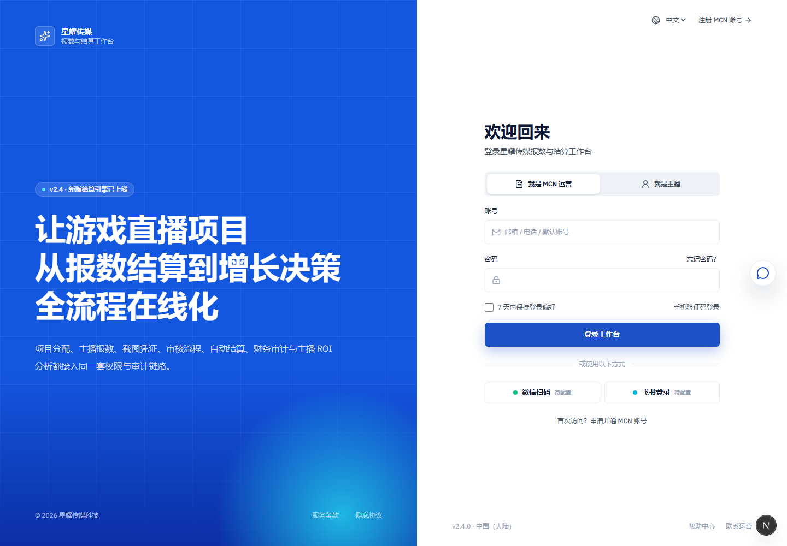

经营端登录步骤：

1. 打开管理员提供的经营端登录地址。
2. 选择“我是 MCN 运营”。
3. 输入邮箱、手机号或管理员分配的默认账号。
4. 输入密码。
5. 点击“登录工作台”。
6. 首次使用子账号时，按页面提示激活账号并设置新密码。
7. 登录后检查左侧菜单是否符合你的岗位。

如果登录失败，先确认账号是否已经由机构管理员开通，再确认密码是否已经完成首次激活。

### 1.2 主播移动端入口

主播在手机上使用移动端入口，适合现场查看任务、上传截图、提交报数和查看审核状态。

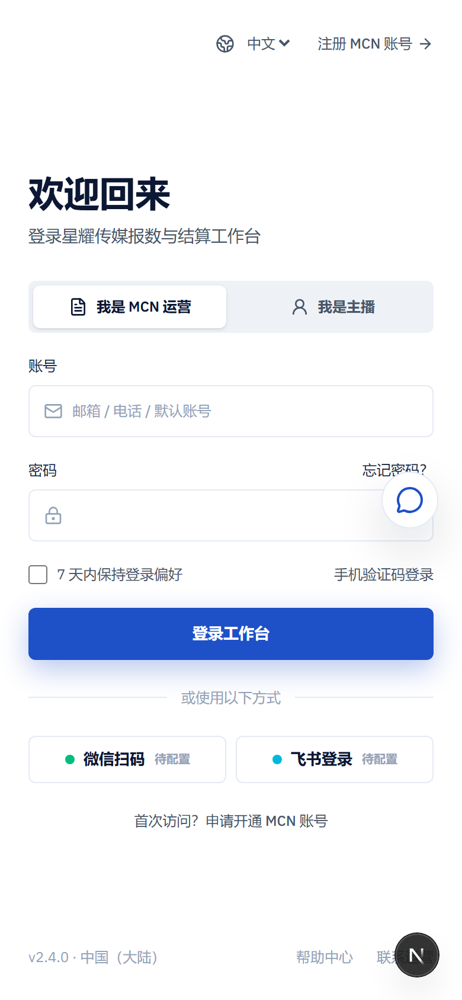

主播登录步骤：

1. 打开主播移动端登录地址。
2. 输入主播账号、手机号或邮箱。
3. 输入密码。
4. 点击“登录移动工作台”。
5. 如果临时密码还没有激活，先完成账号激活。
6. 登录后进入“任务”页，确认今天是否有直播任务。

### 1.3 主播桌面端入口

主播桌面端适合直播前后在电脑上集中处理任务、录屏、AI 诊断、结算账单和个人资料。

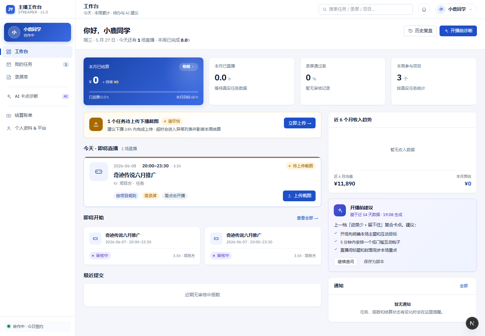

桌面端不替代移动端现场操作。需要拍摄或上传手机截图时，仍建议使用移动端。

## 2. 各角色能做什么

| 角色       | 主要职责                           | 常用页面                                                       | 常见动作                                             |
| ---------- | ---------------------------------- | -------------------------------------------------------------- | ---------------------------------------------------- |
| 负责人     | 管理机构、项目关键决策和高风险动作 | 智能作战台、项目管理、结算中心、操作日志、组织与权限           | 发布项目、确认入项、锁定/重开结算、查看审计          |
| 运营负责人 | 负责项目执行闭环                   | 项目管理、主播资源池、选播准入、排班与任务、报数审核、结算中心 | 发布项目、邀约主播、排班、审核报数、生成结算         |
| 一线运营   | 处理日常执行                       | 项目管理、主播资源池、选播准入、排班与任务、报数审核           | 创建项目草稿、维护主播、处理录屏、创建任务、审核报数 |
| 财务       | 核对结算和导出财务数据             | 结算中心、数据导出                                             | 核对金额、查看批次、导出授权数据                     |
| 主播       | 完成直播任务并提交证据             | 主播任务、录屏、诊断、我的、桌面工作台                         | 查看任务、开播下播、上传截图、确认报数、查看个人结算 |

如果你看不到某个菜单或按钮，通常有两个原因：

1. 当前账号角色没有这个权限。
2. 当前业务状态还没有走到这一步。

例如：一线运营通常可以创建项目草稿，但不能发布项目；财务可以核对结算，但通常不能修改项目规则；主播只能看到自己的任务和个人结算。

## 3. 经营端首页：每天先看智能作战台

登录经营端后，建议先进入“智能作战台”。这里是经营团队的日常总览入口，用来判断今天最该处理什么。

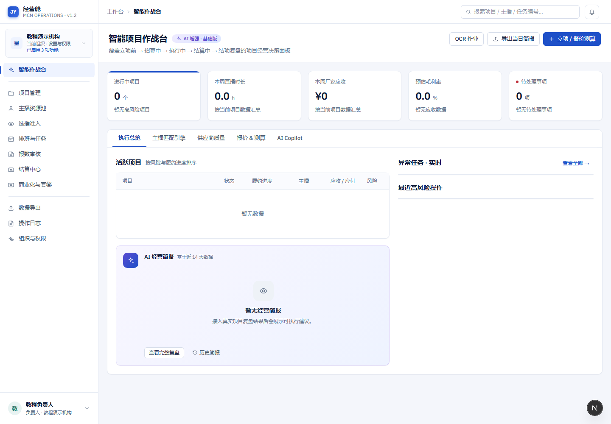

每天上班先看这几项：

1. “进行中项目”：确认当前活跃项目数量。
2. “本周直播时长”：判断项目履约是否正常。
3. “本周厂家应收”：查看本周收入进度。
4. “预估毛利率”：粗看项目盈利情况。
5. “待处理事项”：优先处理影响报数、结算和交付的事项。
6. “异常任务”：查看未开播、未报数、报数超时等异常。
7. “最近高风险操作”：确认是否有人修改结算、重开批次或导出敏感数据。

作战台给的是经营提示，不会自动替你完成高风险动作。发布项目、确认主播、审核报数、锁定结算等动作仍需要有权限的人手动确认。

## 4. 创建和管理项目

项目管理是经营舱的主入口。一个项目代表一次厂商/产品合作或一次直播交付单元。

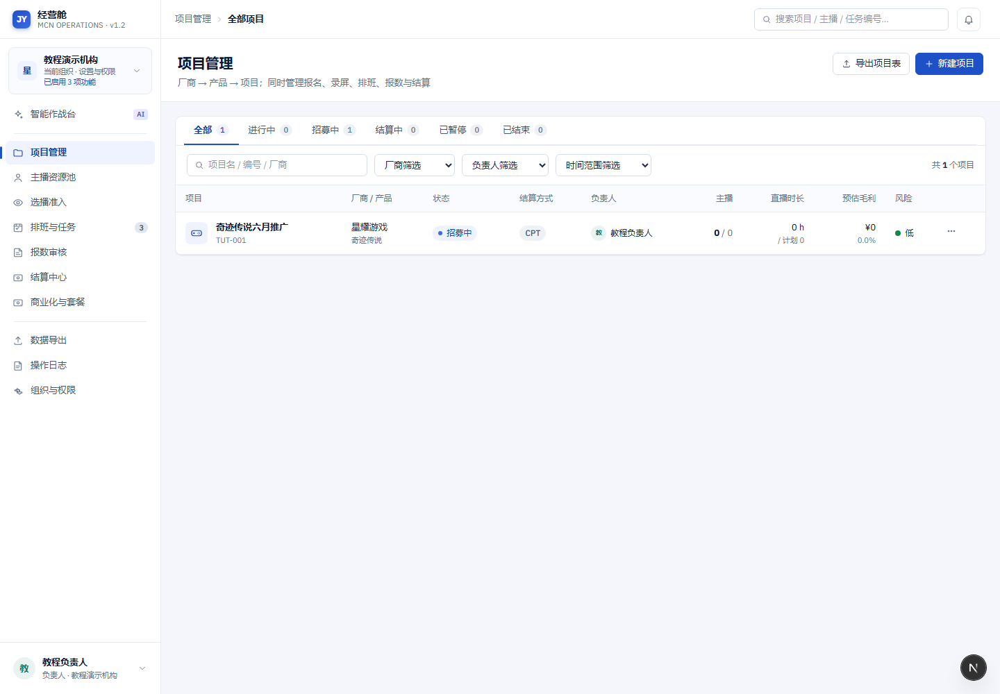

### 4.1 创建项目草稿

适合角色：负责人、运营负责人、一线运营

操作步骤：

1. 进入“项目管理”。
2. 点击“新建项目”。
3. 填写项目名称。
4. 填写项目编号。建议使用固定规则，例如 `TUT-001`、`GAME-202606-001`。
5. 填写厂商、产品、代理商、供应商等信息。
6. 设置起止时间。
7. 选择负责人和运营负责人。
8. 选择默认结算方式，例如 CPT、底薪、底薪 + CPT。
9. 设置是否开放报名、是否允许定向邀约。
10. 设置是否强制录屏。
11. 设置是否要求主播点击开播/停止。
12. 保存为草稿。

草稿创建后还不能正式让主播报名。你需要检查规则后再发布招募。

### 4.2 发布项目招募

适合角色：负责人、运营负责人

操作步骤：

1. 在项目列表打开项目详情。
2. 检查项目名称、厂商、产品、时间、结算规则。
3. 检查录屏要求和系统计时要求。
4. 确认开放报名或定向邀约方式。
5. 点击“发布招募”。
6. 发布后项目进入“招募中”。

注意：

- 一线运营创建的草稿通常需要负责人或运营负责人发布。
- 发布后，项目会进入主播报名、运营邀约和录屏审核环节。
- 如果结算规则需要修改，系统可能要求填写修改原因。

### 4.3 判断项目状态

| 状态   | 你应该做什么                           |
| ------ | -------------------------------------- |
| 草稿   | 补全项目信息，检查结算、录屏、计时规则 |
| 招募中 | 邀约主播、等待报名、处理录屏           |
| 待开播 | 确认主播阵容和排班                     |
| 进行中 | 盯任务、盯报数、处理异常               |
| 已结束 | 关闭执行动作，准备结算                 |
| 结算中 | 核对可结算池和结算批次                 |
| 已归档 | 查看历史数据和复盘                     |

## 5. 主播资源池：先有主播，后有排班

主播资源池用于维护主播档案。没有正式加入项目的主播，不能直接进入直播排班。

### 5.1 创建主播档案

适合角色：负责人、运营负责人、一线运营

操作步骤：

1. 进入“主播资源池”。
2. 点击“创建档案”。
3. 填写主播昵称、真实姓名、手机号或联系信息。
4. 填写平台账号，例如抖音、快手、视频号。
5. 选择品类能力，例如 RPG、SLG、卡牌、新游试玩。
6. 选择直播风格，例如剧情向、高互动、福利转化。
7. 选择来源：自营、签约、外部、供应商推荐等。
8. 设置默认结算规则。
9. 检查风险状态。
10. 保存档案。

如果主播暂时没有登录账号，也可以先建档案，后续再绑定账号。

### 5.2 风险状态怎么用

| 风险状态    | 使用建议                           |
| ----------- | ---------------------------------- |
| 低          | 可以正常报名、邀约、排班           |
| 中          | 排班前建议负责人或运营负责人复核   |
| 高          | 谨慎邀约，必要时要求补充录屏或说明 |
| 黑名单/受限 | 不应进入报名、邀约或排班           |

修改主播风险状态属于高风险动作。请写清楚原因，方便后续追溯。

## 6. 选播准入：录屏通过后还要最终确认

选播准入解决的是“这个主播能不能正式加入这个项目”的问题。

### 6.1 主播报名路径

1. 项目处于“招募中”。
2. 项目允许开放报名。
3. 主播在可见项目中报名。
4. 如果项目强制录屏，主播需要提交录屏链接或文件。
5. 运营审核录屏。
6. 录屏通过后进入“待最终确认”。
7. 负责人或运营负责人确认入项。
8. 系统生成项目内主播关系，并冻结该主播在项目中的结算规则快照。

### 6.2 运营定向邀约路径

1. 项目处于可邀约状态。
2. 项目允许定向邀约。
3. 运营在项目中选择主播。
4. 主播确认或提交录屏。
5. 运营审核录屏。
6. 负责人或运营负责人最终确认入项。

### 6.3 录屏审核注意事项

录屏审核时不要只看“能不能打开”。建议同时检查：

1. 链接是否长期可访问。
2. 内容是否对应项目要求的产品或游戏。
3. 直播风格是否符合厂商要求。
4. 声音、画面、互动是否达到最低要求。
5. 是否有明显违规风险。
6. 如果要求补充，写清楚补充原因。

录屏通过不等于已入项。只有完成最终确认后，主播才可以进入排班。

## 7. 排班与任务：把项目变成一场场直播

排班与任务页面用于创建、查看和处理直播任务。

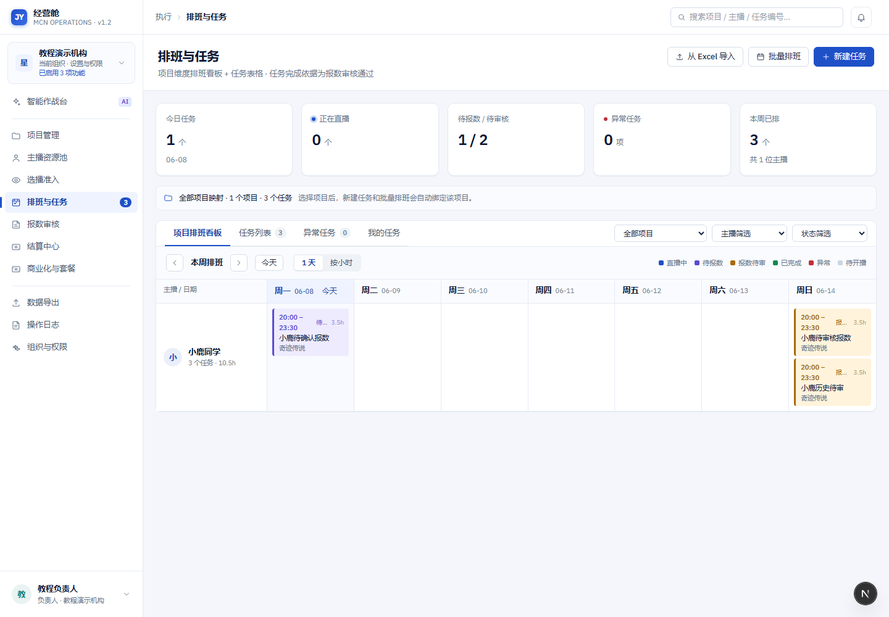

### 7.1 创建单场直播任务

适合角色：负责人、运营负责人、一线运营

操作步骤：

1. 进入“排班与任务”。
2. 点击“新建任务”。
3. 选择项目。
4. 选择已经正式加入项目的主播。
5. 选择计划开播时间。
6. 选择计划结束时间。
7. 确认计划时长。
8. 确认是否要求点击开播/停止。
9. 确认是否要求录屏。
10. 保存任务。

创建完成后，主播会在主播端看到任务。

### 7.2 批量排班

适合多个主播同一项目、同一时间段或相似时间段的场景。

操作建议：

1. 先确认项目主播阵容。
2. 按日期或场次准备排班表。
3. 批量创建任务后，检查任务数量。
4. 抽查 2-3 条任务，确认项目、主播、时间、状态正确。
5. 通知主播确认自己的任务。

### 7.3 常见任务状态

| 状态       | 含义                       | 下一步                      |
| ---------- | -------------------------- | --------------------------- |
| 待开播     | 任务已排好，主播还没开始   | 主播按时点击开始直播        |
| 直播中     | 主播已点击开始             | 直播结束后点击停止          |
| 待上传截图 | 已下播，等待提交截图和报数 | 主播上传截图并确认 OCR 结果 |
| 审核中     | 主播已提交报数             | 运营审核                    |
| 审核通过   | 报数通过                   | 进入可结算池                |
| 审核驳回   | 报数不通过                 | 主播补充或重新提交          |
| 异常       | 任务存在风险               | 运营先处理异常原因          |

## 8. 主播移动端：完成一场直播

主播移动端是主播的现场工作台。主播登录后会看到任务统计、今日任务、待上传截图和审核中任务。

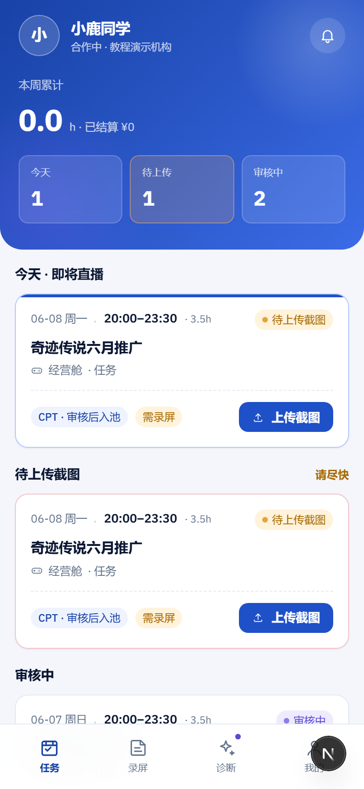

### 8.1 查看今日任务

操作步骤：

1. 打开主播移动端。
2. 进入“任务”。
3. 查看顶部统计：今天任务数、待上传数、审核中数。
4. 查看任务卡片上的项目名称、时间、时长、结算提示和录屏要求。
5. 如果任务要求录屏，提前准备录屏工具和录屏链接。
6. 如果任务要求点击开播/停止，直播前后必须在 App 内操作。

如果主播看不到任务，请让运营确认三件事：

1. 主播是否已经正式加入项目。
2. 是否已经创建排班任务。
3. 当前账号是否绑定到了正确主播档案。

### 8.2 开播和下播

项目要求系统计时时，主播必须点击开始和停止。

标准步骤：

1. 直播开始前进入任务详情。
2. 点击“开始直播”。
3. 正常完成直播。
4. 直播结束后点击“结束直播 + 上传截图”或“停止直播”。
5. 上传下播截图。
6. 按页面提示确认识别结果。

系统计时是结算证据的一部分。如果忘记点击开始或停止，任务可能进入异常，需要运营补充原因。

### 8.3 上传截图并确认 OCR 结果

真实 OCR 接入后，主播上传下播截图，系统会自动识别直播时长、场观等字段。主播需要核对识别值，必要时直接修改。

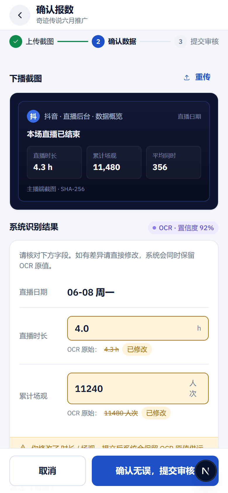

确认报数步骤：

1. 在任务卡片点击“上传截图”。
2. 在任务详情点击“从相册选择截图”。
3. 上传包含直播时长和场观的下播截图。
4. 查看“系统识别结果”。
5. 核对直播日期。
6. 核对直播时长。
7. 核对累计场观。
8. 如果 OCR 识别不准，直接修改字段。
9. 在备注里说明特殊情况，例如设备掉线、平台统计延迟、补播等。
10. 点击“确认无误，提交审核”。

页面会保留 OCR 原始值和主播修改值。运营审核时可以看到两者的差异。

### 8.4 OCR 失败时怎么用

如果截图上传后没有自动识别结果，主播仍然可以手动填写直播时长和场观后提交。运营可以在“真实 OCR 作业”里查看失败原因、手动重试，或改走人工核对截图流程。不要让结算无限等待 OCR 队列。

### 8.5 提交后看哪里

提交后任务通常进入“审核中”。主播可以在任务页看到审核状态。

如果运营驳回或要求补充，主播应：

1. 打开对应任务。
2. 查看驳回原因。
3. 重新上传截图或补充说明。
4. 再次提交审核。

## 9. 主播桌面端：直播前后的集中工作台

主播桌面端适合在电脑上处理更完整的工作流。


常用区域：

1. “我的任务”：查看今天和近期任务。
2. “录屏库”：提交历史录屏或项目要求录屏。
3. “AI 卡点诊断”：查看直播表现建议。
4. “结算账单”：查看个人应付和审核状态。
5. “个人资料 & 平台”：查看档案、平台账号和结算规则提示。

主播桌面端只展示个人相关数据，不展示其他主播、厂家应收、MCN 毛利、内部成本等信息。

## 10. 运营审核报数

主播提交报数后，运营在“报数审核”处理。

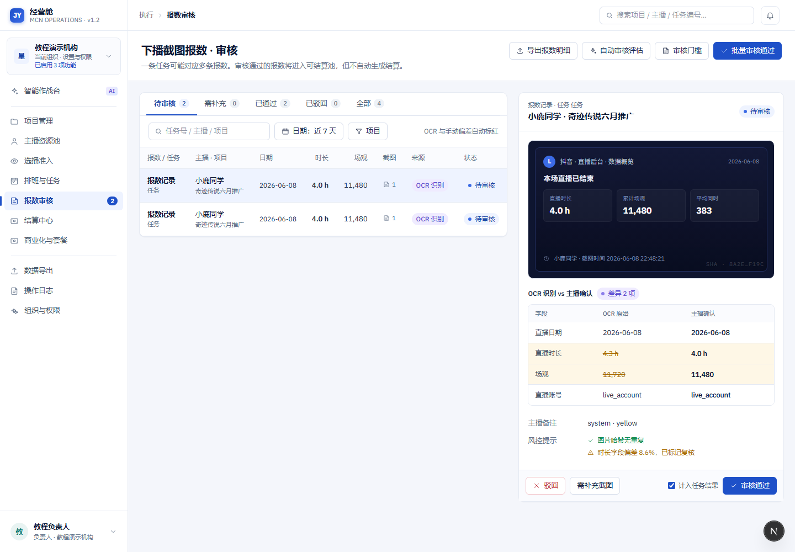

### 10.1 审核前先看三类证据

1. 系统计时：主播在 App 内点击开始和停止形成的时长。
2. 截图识别：OCR 或人工读取下播截图得到的时长和场观。
3. 主播确认：主播提交前确认或修改后的值。

如果三类数据一致，审核通常可以快速通过。如果存在差异，需要看风险提示和主播备注。

### 10.2 证据颜色怎么理解

| 证据等级 | 含义                       | 处理建议                 |
| -------- | -------------------------- | ------------------------ |
| 绿色     | 系统计时和截图基本一致     | 可优先通过               |
| 黄色     | 有证据，但存在缺失或差异   | 人工核对后决定           |
| 红色     | 主要依赖人工填报或证据不足 | 谨慎通过，必要时要求补充 |

### 10.3 审核动作

| 动作       | 适用场景                   | 结果                        |
| ---------- | -------------------------- | --------------------------- |
| 审核通过   | 证据可信，数据可结算       | 报数进入可结算池            |
| 驳回       | 数据明显错误或截图不合格   | 主播需要重新提交            |
| 需补充截图 | 截图缺字段、打不开或不清晰 | 主播补充后再审              |
| 进入复核   | 有争议或金额影响较大       | 负责人/运营负责人进一步判断 |

审核通过不等于马上结算。通过后只是进入可结算池，还需要按周期生成结算批次。

## 11. OCR 作业：真实 OCR 接入后的运维入口

真实 OCR 接入后，经营端可以在智能作战台打开“OCR 作业”。这里用于查看 OCR 队列、失败重试、人工确认和需复核作业。

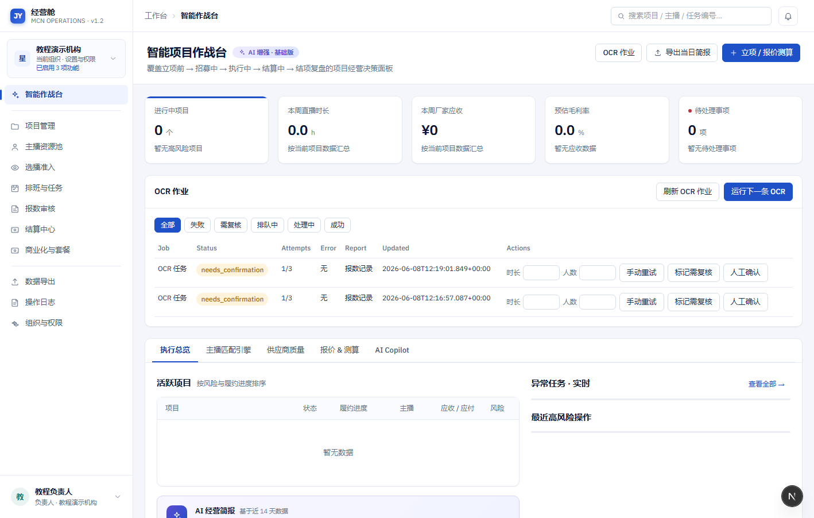

### 11.1 什么时候看 OCR 作业

建议在以下场景查看：

1. 主播说截图上传后没有识别结果。
2. 报数审核里出现大量 OCR 差异。
3. OCR 服务商异常或调用失败。
4. 需要人工确认低置信度识别结果。
5. 需要重试失败作业。

### 11.2 常见 OCR 作业状态

| 状态                 | 含义                   | 处理方式                     |
| -------------------- | ---------------------- | ---------------------------- |
| queued / pending     | 已排队，等待识别       | 等待或点击运行下一条 OCR     |
| running / processing | 正在识别               | 等待完成                     |
| succeeded            | 识别成功               | 正常进入主播确认或运营审核   |
| needs_confirmation   | 识别完成但需要人工确认 | 填写修正值并人工确认         |
| needs_review         | 需要复核               | 由运营或负责人核对           |
| failed               | 识别失败               | 手动重试，必要时改为人工处理 |

### 11.3 人工确认 OCR

当 OCR 结果需要人工确认时：

1. 打开“OCR 作业”。
2. 找到对应作业。
3. 查看报数记录和错误信息。
4. 在“时长”和“人数”输入修正值。
5. 点击“人工确认”。
6. 回到报数审核，继续审核该报数。

如果服务商异常导致失败，先点击“手动重试”。如果多次失败，使用人工填报流程，不要让结算卡在 OCR 队列里。

## 12. 财务核对结算

财务和运营负责人在“结算中心”处理可结算池和结算批次。

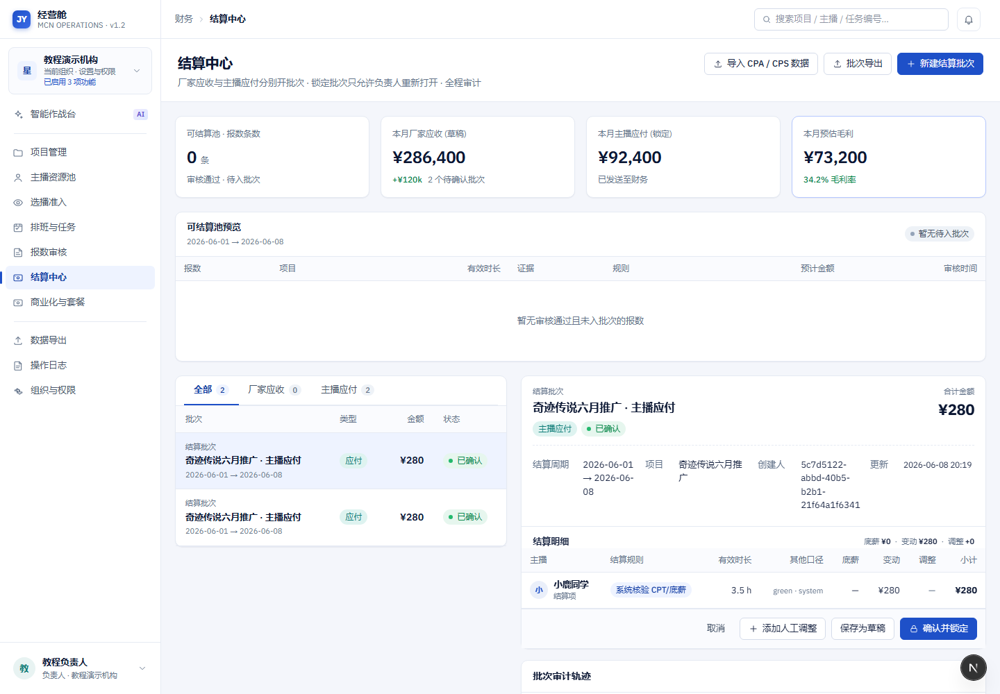

### 12.1 从报数到结算的关系

1. 主播提交报数。
2. 运营审核通过。
3. 报数进入可结算池。
4. 运营或财务按周期生成结算批次。
5. 财务核对金额。
6. 有权限的人确认或锁定批次。
7. 导出结算表。

### 12.2 核对可结算池

核对时重点看：

1. 项目名称是否正确。
2. 主播是否正确。
3. 有效直播时长是否正确。
4. 证据等级是否可信。
5. 结算规则是否符合项目约定。
6. 预计金额是否异常。

如果发现错误，先回到报数审核或项目规则处处理，不要直接在结算里凑数。

### 12.3 核对结算批次

每个批次至少检查：

1. 批次类型：主播应付或厂家应收。
2. 结算周期。
3. 明细数量。
4. 系统计算金额。
5. 人工承载金额。
6. 调整金额。
7. 总金额。
8. 证据摘要。
9. 批次状态。

批次锁定后发现错误，需要有权限的人填写原因后重开，再重新核对。

### 12.4 主播端能看到什么

主播端只看到个人应付、安全结算明细和审核状态。以下信息不会展示给主播：

1. 厂家应收。
2. MCN 毛利。
3. 内部成本。
4. 其他主播结算。
5. 内部风险备注。

## 13. 数据导出和交付

“数据导出”用于生成项目、主播、报数、结算和厂家交付相关数据。

### 13.1 导出前检查

导出前先确认：

1. 导出的项目是否正确。
2. 导出的时间范围是否正确。
3. 导出给谁看：内部、财务、厂家或复盘。
4. 是否包含敏感字段。
5. 当前账号是否有权限导出这些字段。

### 13.2 对外交付建议

对外交付给厂家时，建议只包含：

1. 项目基础信息。
2. 主播名单或候选名单。
3. 执行进度。
4. 直播场次和有效时长。
5. 截图或录屏证明。
6. 交付汇总。

不要对外导出内部成本、毛利、主播风险备注、其他项目财务信息。

### 13.3 导出后在哪里看

导出完成后，通常可以在导出列表或通知里查看结果。敏感导出会留下操作记录，负责人可以在操作日志里追溯。

## 14. 操作日志和高风险动作

以下动作属于高风险动作，系统会记录原因和操作人：

| 动作             | 为什么高风险             |
| ---------------- | ------------------------ |
| 修改项目结算规则 | 会影响后续金额           |
| 修改主播风险状态 | 会影响报名、邀约和排班   |
| 修改主播报数值   | 会影响结算               |
| 锁定结算批次     | 会影响财务确认和主播收益 |
| 重开锁定批次     | 会改变已确认结果         |
| 导出敏感数据     | 涉及数据安全             |

高风险动作建议写原因时包含：

1. 为什么要改。
2. 影响哪个项目或主播。
3. 和谁确认过。
4. 是否需要后续复核。

## 15. 一天的标准工作节奏

### 15.1 运营每天早上

1. 打开智能作战台。
2. 看待处理事项和异常任务。
3. 看今天排班。
4. 确认主播是否都知道任务。
5. 处理待审核录屏。
6. 检查昨天未报数和待审核报数。

### 15.2 运营每天晚上

1. 看当天待上传截图任务。
2. 催促主播补报数。
3. 审核当天已提交报数。
4. 标记异常任务原因。
5. 对重要项目生成或查看阶段简报。

### 15.3 财务每个结算周期

1. 查看可结算池。
2. 按项目和周期生成批次。
3. 核对明细。
4. 对异常金额回到报数或项目规则处核查。
5. 确认批次。
6. 导出结算表。
7. 留存交付文件。

### 15.4 负责人每周

1. 查看作战台复盘。
2. 查看高风险操作。
3. 查看结算批次锁定和重开记录。
4. 查看导出记录。
5. 检查高风险主播和异常项目。
6. 根据复盘调整报价、选播和供应商策略。

## 16. 主播个人工作清单

直播前：

1. 查看今天任务。
2. 确认项目名称和时间。
3. 确认是否要求录屏。
4. 确认是否必须点击开始/停止。
5. 准备直播工具。

直播中：

1. 按时开播。
2. 保持录屏或直播后台可查。
3. 遇到中断及时记录原因。

直播后：

1. 点击停止直播。
2. 上传下播截图。
3. 核对 OCR 识别值。
4. 必要时修改并填写备注。
5. 提交审核。
6. 关注审核结果。

结算期：

1. 查看个人结算账单。
2. 对有疑问的明细发起复核。
3. 不要通过群聊单独改数，优先在系统里留痕。

## 17. 常见问题

**我登录后看不到某个菜单**

先确认账号角色。财务、主播、一线运营看到的菜单不同。如果角色正确仍看不到，请联系机构管理员检查权限。

**我无法发布项目**

发布项目通常需要负责人或运营负责人权限。项目也必须处于可发布状态。

**主播看不到任务**

请确认主播已经正式加入项目，并且运营已经为该主播创建排班。

**主播无法报数**

请确认任务已经到达可报数状态。如果项目要求点击开始/停止，需要先完成直播开始和结束动作。

**OCR 识别不准怎么办**

主播可以在确认页直接修改。系统会保留 OCR 原始值和主播确认值，运营审核时可以看到差异。

**OCR 失败会不会影响结算**

不应该让结算无限等待 OCR。运营可以重试 OCR；如果仍失败，可以走人工核对截图和报数的流程。

**报数审核通过后为什么还没有结算金额**

审核通过只代表进入可结算池。还需要在结算中心按周期生成结算批次。

**结算批次锁定后发现错误怎么办**

联系负责人。锁定批次需要有权限的人填写原因后重开，再重新核对和锁定。

**主播为什么看不到厂家应收或毛利**

这是数据安全设计。主播端只展示个人应付和本人相关安全明细。

**导出数据缺字段**

导出结果会根据账号权限和敏感级别过滤。请确认当前账号是否有权限查看该字段。

**录屏通过了，为什么还不能排班**

录屏通过后还需要负责人或运营负责人最终确认入项。只有正式入项后才能排班。

## 18. 新机构上线建议

第一次正式使用时，建议按这个顺序准备：

1. 创建机构负责人账号。
2. 创建运营负责人、一线运营、财务账号。
3. 创建 3-5 个主播档案。
4. 创建一个真实项目草稿。
5. 发布招募。
6. 邀约一个主播。
7. 提交并审核录屏。
8. 最终确认主播入项。
9. 创建一场直播任务。
10. 主播用移动端完成开播、下播、截图、报数。
11. 运营审核报数。
12. 生成一条结算批次。
13. 财务核对并导出。
14. 负责人查看操作日志和作战台复盘。

这条小闭环跑通后，再扩大到更多项目和主播。

## 19. 上线前最后检查

正式上线前建议逐项确认：

| 检查项                              | 是否完成 |
| ----------------------------------- | -------- |
| 负责人、运营、财务、主播账号已创建  |          |
| 子账号首次登录激活流程可用          |          |
| 项目创建和发布可用                  |          |
| 主播档案创建可用                    |          |
| 录屏提交和审核流程可用              |          |
| 已入项主播才能排班                  |          |
| 主播移动端能看到任务                |          |
| 主播能上传截图并确认报数            |          |
| 真实 OCR 已接入或人工核对流程已明确 |          |
| 运营能审核报数                      |          |
| 审核通过后能进入可结算池            |          |
| 能生成结算批次                      |          |
| 财务能核对和导出                    |          |
| 主播端不会看到内部财务字段          |          |
| 高风险操作要求填写原因              |          |
| 操作日志可追溯                      |          |

## 20. 最短闭环演练脚本

如果你只想验证产品是否已经可以跑通，按下面这条最短脚本执行：

1. 负责人登录经营端。
2. 创建项目草稿。
3. 发布招募。
4. 创建主播档案。
5. 邀约主播。
6. 提交录屏。
7. 运营审核录屏通过。
8. 负责人最终确认主播入项。
9. 运营创建直播任务。
10. 主播登录移动端。
11. 主播查看任务。
12. 主播点击开始直播。
13. 主播点击结束直播。
14. 主播上传截图。
15. 主播核对 OCR 或手动填写报数。
16. 主播提交审核。
17. 运营审核通过。
18. 财务进入结算中心。
19. 生成结算批次。
20. 核对金额。
21. 导出结算数据。
22. 负责人查看操作日志和复盘。

做到第 22 步，就代表经营舱从项目执行到结算交付的核心闭环已经跑通。

---

## 21. 供需撮合论坛（派单市场）

供需撮合论坛是一个面向全平台的公开撮合社区：游戏厂商把消化不完的「分包订单（二手单）」对外释放，平台内 MCN 主动发现并接单，平台 AI 在中间做市场情报与智能匹配。核心原则：**信息默认全公开，靠「成交必须经平台」保护收益**。

入口：左侧导航「供需撮合论坛」。页面有四个页签：撮合广场 / 我的发布 / 我的投递 / 发布需求。

### 21.1 发布需求（发单方 / 厂商）
1. 进「发布需求」，填写结构化字段：标题、产品名、品类、预算/报价、结算方式、对主播/MCN 的要求、截止时间、需求描述。
2. 「联系方式」单独填，**不公开**，仅在达成后对家可见（防止私下接触白嫖）。
3. 点「发布到广场」即对全平台 MCN 公开；或「存草稿」暂不公开。

### 21.2 发现与投递（接单方 / MCN）
1. 在「撮合广场」浏览公开需求，可按品类、关键词筛选。
2. 点开某条需求，填写接单资料：报价、主播阵容、过往案例、可投入资源、联系方式（不公开）。
3. 提交后进入「我的投递」，状态为「已投递」。

### 21.3 审核与达成
1. 发单方在需求详情页看到「收到的投递」，可对每条投递「通过 / 驳回 / 要求补充」。
2. 接单方在投递「已通过」后，点「确认达成」→ 平台记录撮合关系，需求转「已撮合」。
3. 达成后可进一步桥接到现有「MCN 协作」流程（发单方选一个已启用协作的项目→生成分享→接单方提交协作申请→走审核激活）。

### 21.4 AI 撮合情报
撮合广场顶部有一条情报信息流，个人面板「今日推荐」也会出现撮合推荐：
- **市场动态**：近 N 天新出现的产品 / 二手单；
- **供给热度**：在发布需求的组织数、品类与预算分布；
- **接单画像**：哪些 MCN 在接单、覆盖品类 / 报价区间 / 已达成数；
- **智能匹配**：按你的属性（厂商/接单方）推荐最相关的需求/接单方，并给出理由。

情报均来自公开撮合数据的**确定性聚合**，数字以平台结构化数据为准，不由模型编造。

---

## 22. AI Copilot 与大模型接入

### 22.1 在哪里用
入口：「智能作战台」→ 经营总览看板下方的「AI Copilot」面板，四个能力：
- **候选简报**：基于匹配快照，生成可邀约候选的解释；
- **AI 项目复盘**：读取经营复盘代理输出，给结论 / 风险 / 建议；
- **运行 Copilot**：统一调度脚本优化等意图；
- **生成脚本草稿**：产出待人工复核的话术版本。

点按钮后等待返回一段中文结论即可。所有 AI 建议都**需人工确认后才生效**，AI 不会自动执行不可逆动作。

### 22.2 安全铁律
- AI 继承操作者的权限与 RLS，不做越权查询；
- 确定性逻辑（证据颜色 / CPT / 应收应付）由规则引擎负责，AI 只做解释与非落库预判；
- 数字必须可溯源，知识库问数无结构化来源时一律答「无数据」，绝不编造；
- 高敏动作（结算确认 / 入项 / 冻结等）AI 只能出草稿，确认权归人。

### 22.3 大模型 Provider 配置（运维）
系统支持多家大模型，按 `.env.local` 配置启用，缺 key 时自动降级为「确定性回退」（返回模板文本、不计费）：
- OpenAI：`OPENAI_API_KEY`、`OPENAI_MODEL`；
- 腾讯混元：`HUNYUAN_API_KEY`、`HUNYUAN_BASE_URL`、`HUNYUAN_MODEL`；
- **DeepSeek**：`DEEPSEEK_API_KEY`（OpenAI 兼容，base/model 已内置默认 `https://api.deepseek.com` / `deepseek-v4-flash`）；
- 主模型用 `AI_PRIMARY_PROVIDER` 指定（如 `deepseek`）；改完 `pm2 restart` 即生效。

### 22.4 怎么确认 AI 真在用某家模型
后台台账表 `ai_invocations` 记录每次调用：`provider_name`（openai/hunyuan/deepseek/deterministic）、`status`（succeeded/failed/degraded）、`total_tokens`、`cost_cents`、`latency_ms`。看到 `deepseek / succeeded / tokens>0` 即为真实调用；`deterministic / degraded` 表示未配 key 走了回退。

---

## 23. 知识库

入口：左侧导航「知识库」。这是一个 Notion 式的文档库，任务复盘会自动归档（直属库 / 复盘 / 项目 / 主播 / 复盘文件），也支持自定义文件夹与页面、任意层级嵌套、重命名 / 移动 / 删除。

- **文档编辑**：块式编辑器，支持标题、列表、表格等；
- **导出**：单篇可导出 Markdown / PDF / Word；
- **分享链接**：生成只读分享链接对外发送；
- **云端同步**：线上以腾讯云 COS 存储桶为共享真源，离线回退本地缓存；
- **使用教程**：本篇《经营舱图文使用教程》默认内置在知识库，所有人打开即可查阅。

---

## 24. 经营总览看板与个人面板

「智能作战台」首页是按当前登录角色实时计算的经营总览看板：风险提醒、项目/复盘/结算/审计待办、经营数据（厂家应收、预计毛利、毛利率、高风险事项）、进行中项目、准入漏斗等，全部为真实业务数据。右侧个人信息面板含问候+身份、大盘总览、今日推荐（含撮合推荐）、待办事项。
