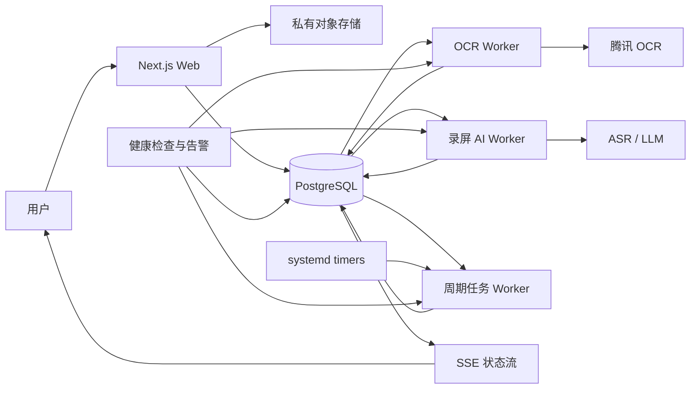

# 腾讯云 PostgreSQL 后台任务与最佳用户体验设计

- 状态：已确认，待实施计划
- 日期：2026-07-14
- 适用范围：OCR、录屏 AI、周期扫描任务，以及这些任务的用户状态反馈和运营治理
- 生产环境：腾讯云自托管 Next.js、PostgreSQL/Supabase、PM2、Nginx

## 1. 结论

生产后台任务采用“PostgreSQL 持久化队列 + 腾讯云独立 Worker + systemd 服务与定时器 + SSE 状态推送”的架构，不新增 Redis，不依赖 GitHub Actions 或 GitHub self-hosted runner 执行生产任务。

GitHub可以继续用于源代码托管和可选代码检查，但生产环境已经部署的版本在 GitHub、Actions 或 runner 不可用时必须继续完成以下闭环：

`提交 -> 持久化入队 -> 排队反馈 -> 执行 -> 自动重试 -> 人工兜底 -> 结果确认 -> 站内通知 -> 运营监控 -> 周期补偿`

本设计复用现有 OCR 与录屏 AI 的数据库认领、重试和超时恢复能力，将重计算从 Web 进程移到独立 Worker，并补齐用户可见状态、资源隔离、跨机构公平调度、健康监控和腾讯云本地调度。

## 2. 目标与非目标

### 2.1 目标

1. 用户提交成功后立即获得可恢复的任务身份，不需要停留在当前页面等待。
2. OCR、录屏 AI 和周期任务不因 GitHub Actions 额度、runner 离线或 GitHub 故障停止。
3. Web 服务只负责鉴权、校验、上传和入队，后台重任务不能拖慢登录、页面访问、上传或结算。
4. Worker、Web 服务或整台服务器重启后，已入队任务不丢失并可以自动恢复。
5. 用户看到明确阶段、下一步和可操作的失败信息；运营看到队列、Worker和服务商健康度。
6. 不同任务类型独立限流，并在多机构场景下公平消费。
7. 保持 AI 的安全边界：AI产出草稿和建议，高风险结算动作仍需有权限的用户确认。

### 2.2 非目标

1. 本期不引入 Redis、BullMQ、Kafka、Temporal 或其他新增队列中间件。
2. 本期不增加短信、微信或外部推送；完成和失败通知先进入站内通知中心。
3. 本期不让 AI自动锁定结算、修改历史批次、修改原始证据或执行资金动作。
4. 本期不要求脱离 GitHub完成源代码管理；要求的是生产运行期零 GitHub依赖。发布流程可继续从 GitHub拉取代码，同时保留后续增加离线制品发布的空间。
5. 本期不将交互式 AI对话强行改造成后台任务。

## 3. 当前基础与主要缺口

### 3.1 可复用基础

- OCR任务已经写入 `background_jobs`，包含状态、尝试次数、下次执行时间和锁信息。
- OCR认领 RPC 已使用 `FOR UPDATE SKIP LOCKED`，能够避免并发Worker重复领取。
- OCR支持自动重试、最终失败、人工重试和过期锁回收。
- 录屏 AI 已有 `queued -> running -> completed/failed` 状态、尝试次数和超时认领恢复。
- 用户提交 OCR 和录屏 AI 后已有进程内即时 kick，正常低并发下能够快速启动。
- 内部 runner 路由已有令牌保护，可在迁移阶段和回滚时继续使用。
- 星耀会话协议已经提供交互式 AI 会话的持久化、租约、重试和流式响应基础。

### 3.2 需要解决的缺口

- 进程内并发闸门只保护单个 Node进程，不能跨进程或跨服务器统一限流。
- 录屏提取、ASR和AI分析仍可能与Web服务争夺CPU、内存和临时磁盘。
- 进程内 kick 失败或并发已满时依赖外部定时触发补偿。
- GitHub调度与生产执行耦合，Actions额度或runner状态会影响积压任务清理和周期扫描。
- 用户侧缺少统一、可恢复的任务阶段、结果通知和失败自助入口。
- 运营侧缺少Worker心跳、最久等待、队列趋势和服务商熔断状态。
- 当前runner身份偏向固定机构配置，不适合作为完整多机构调度器。

## 4. 总体架构

### 4.1 进程边界

| 进程 | 管理方式 | 责任 | 默认并发 |
| --- | --- | --- | --- |
| `jingying-web` | 现有 PM2 | 页面、鉴权、校验、上传、快速入队、状态读取与SSE | Web并发模型 |
| `jingying-worker-ocr` | systemd service | OCR认领、私有图片解析、腾讯OCR调用、结果持久化 | 3 |
| `jingying-worker-recording-ai` | systemd service | 音频提取、ASR、LLM分析、报告持久化 | 1 |
| `jingying-worker-maintenance` | systemd oneshot/timer | 异常扫描、账户指标、闲置扫描、智能学习和补偿任务 | 1 |
| `jingying-worker-watchdog` | systemd timer | 心跳检查、过期租约检测、积压告警 | 单实例 |

Web 与 Worker共享 PostgreSQL，但不共享进程内队列。数据库是任务状态和业务结果的唯一事实源。

### 4.2 为什么不使用 Redis

现有任务已经落在 PostgreSQL，并具备原子认领基础。独立Worker以1秒左右的空闲轮询间隔领取任务，配合现有提交后即时反馈，足以满足当前实时体验。增加Redis会引入第二事实源、额外费用、双写一致性和新的运维故障面，当前收益不足以覆盖成本。

当持续任务量超过单个PostgreSQL队列和多Worker节点的能力时，再以实际指标决定是否升级中间件。

## 5. AI执行边界

不是所有AI都进入后台队列。

### 5.1 保持实时会话的能力

自定义结算规则AI继续使用星耀会话协议和SSE流式响应。用户需要看到澄清、公式草稿和试算过程，后台排队会降低可理解性。

结算规则流程固定为：

`自然语言描述 -> AI澄清 -> 公式草稿 -> 示例试算 -> 影响预览 -> 用户确认 -> 一键应用`

“一键应用”仍是经过权限检查、版本检查和用户确认的业务事务。AI不能直接锁定批次、覆盖历史结果或执行资金动作。

### 5.2 进入后台Worker的能力

- OCR截图识别。
- 录屏音频提取、ASR和长耗时AI分析。
- 超过同步时间预算的大样本结算模拟；模拟结果完成后回到规则会话供用户确认。
- 异常扫描、指标同步、闲置扫描、智能学习和历史补算。

同步时间预算以10秒为边界：预计无法在10秒内稳定完成、可恢复且不要求逐字流式交互的任务，应进入后台Worker。

## 6. 任务模型与状态机

### 6.1 领域表保持事实源

首期不把所有任务强行迁移到一张新队列表：

- OCR继续使用 `background_jobs` 和OCR结果表。
- 录屏AI继续使用 `recording_ai_analyses` 作为分析任务和结果事实源。
- 周期任务使用执行记录表保存每次运行结果。

服务层通过统一 `AsyncTaskDto` 向用户和运营端投影，不建立一份可漂移的重复状态主表。

### 6.2 公共运行字段

OCR与录屏AI的领域表需要提供等价的公共字段：

- `organization_id`
- `requested_by`
- `status`
- `stage`
- `priority`
- `attempt`
- `max_attempts`
- `run_after`
- `claimed_at`
- `claimed_by`
- `lease_expires_at`
- `started_at`
- `completed_at`
- `idempotency_key`
- `error_code`
- `error_summary`
- `cancel_requested_at`
- `created_at`
- `updated_at`

迁移采用新增可空字段、回填、再加约束的顺序，不破坏现有任务。

### 6.3 状态与阶段

统一任务状态：

- `queued`：已持久化，等待领取。
- `running`：已被Worker领取。
- `needs_confirmation`：机器结果已生成，等待用户核对。
- `succeeded`：业务结果已经完成并持久化。
- `failed`：已达到最终失败条件，需要用户或运营处理。
- `cancelled`：排队任务已取消，或运行任务已在安全检查点停止后续步骤。

`stage` 用于表达任务内部进度，不作为最终业务状态：

- OCR：`validating -> resolving_image -> recognizing -> persisting -> waiting_confirmation`
- 录屏AI：`validating -> extracting_audio -> transcribing -> analyzing -> generating_report -> persisting`
- 周期任务：`scanning -> processing -> persisting`

状态只能按定义的状态机迁移。最终状态不能被普通Worker覆盖，人工重试通过显式重试动作生成新的尝试记录。

### 6.4 任务事件

新增只追加的 `async_task_events`，记录组织、任务类型、任务ID、状态、阶段、尝试次数、错误码、Worker和时间。事件用于：

- 用户任务时间线。
- 运营诊断。
- 重试和取消审计。
- 处理耗时与失败率统计。

事件不存储密钥、完整提示词、原始文件地址或服务商完整错误响应。

### 6.5 Worker与周期执行记录

新增 `worker_instances` 保存 `worker_id`、类型、主机、应用版本、当前并发、暂停状态、最后心跳和资源保护状态。Worker启动时登记，运行时续心跳，优雅退出时标记停止；异常退出由心跳超时推导，不依赖进程主动回写。

新增 `scheduled_job_runs` 保存周期任务键、计划时间、实际开始时间、完成状态、错误码和单实例键。`job_key + scheduled_for` 唯一，确保服务器重启补跑或timer重复唤醒时，同一计划周期只执行一次。

## 7. 认领、租约与幂等

### 7.1 原子认领

所有认领通过PostgreSQL RPC完成，使用 `FOR UPDATE SKIP LOCKED`。RPC只向service role开放，不向普通用户开放。

平台Worker可以跨机构领取，但每个返回任务必须携带 `organization_id`。执行时创建该机构范围内的系统Actor，不冒充具体用户，并将Worker身份写入审计日志。

### 7.2 租约

- Worker每30秒写一次自身心跳。
- Worker心跳超过60秒未更新时标记为离线并告警。
- 任务租约默认120秒，执行期间每30秒续租。
- 租约过期后任务重新可认领；已耗尽尝试次数的任务直接进入最终失败。
- 长外部调用必须在独立心跳循环中续租，不能依赖调用完成后才刷新。

因此Worker故障可在60秒内被发现，任务通常在120至150秒内重新进入可执行状态。

### 7.3 幂等

用户发起请求携带稳定的 `Idempotency-Key`。数据库按 `organization_id + task_type + source_object_id + idempotency_key` 建立唯一约束。

外部调用和结果持久化均绑定稳定的调用标识。重复请求、网络重放或租约恢复不能：

- 创建两份报数。
- 创建两份录屏分析结果。
- 重复应用结算规则。
- 重复发送完成通知。

## 8. 优先级与公平调度

### 8.1 优先级

| 优先级 | 任务 |
| --- | --- |
| P0 | 用户正在等待的OCR、结算规则AI所需的后台模拟 |
| P1 | 用户主动发起的录屏AI分析 |
| P2 | 异常扫描、账户指标、闲置扫描、智能学习 |
| P3 | 历史补算、批量重新分析 |

认领顺序按有效优先级、`run_after`、创建时间排序。等待时间达到阈值后逐级提升有效优先级，避免低优先级永久饥饿。

### 8.2 机构公平

每轮认领先按机构分组，每个机构最多取一个候选，再进入下一轮。单机构默认同时运行上限：OCR 3、录屏AI 1；平台总并发仍由Worker进程控制。

该策略保证大机构不能长期占满全部执行槽。未来付费服务等级只能调整权重或并发配额，不能绕过权限、幂等或审计。

## 9. 重试、熔断与人工兜底

### 9.1 错误分类

可自动重试：

- 网络超时或连接重置。
- 服务商429限流。
- 服务商5xx或临时不可用。
- Worker进程异常退出。

不可自动重试：

- 文件类型、大小、时长或内容不合法。
- 对象不存在或用户无权访问。
- 必填业务字段缺失。
- 结果结构持续不符合契约。
- 明确的配额、账号或密钥配置错误。

### 9.2 重试策略

默认最多3次，退避为 `30秒 -> 2分钟 -> 5分钟`，并增加小幅随机抖动，避免大量任务同时重试。手动重试必须记录Actor、原因和原任务关系。

### 9.3 服务商熔断

同一服务商在滚动窗口内连续失败达到阈值后暂停新调用。任务保留在数据库，UI显示“服务暂时繁忙，任务已保留”，健康探测恢复后自动继续。

OCR最终失败后允许主播人工填写，运营仍能查看原图、失败原因和修改差异。结算AI不可用时保留可视化规则编辑器，不阻塞核心结算工作。

## 10. 用户体验

### 10.1 提交与离开页面

上传完成并入队后，API在1秒目标时间内返回任务ID和持久化状态。只有数据库写入成功才显示“已提交”；数据库不可用时明确失败，不能伪装成已提交。

用户可以关闭页面。重新进入后从数据库恢复任务，不依赖浏览器内存或本地历史。

### 10.2 统一状态文案

`上传中 -> 已提交 -> 排队中 -> 处理中 -> 待确认 -> 已完成`

异常分支使用：

- `自动重试中`：显示下一次重试时间。
- `服务暂时繁忙`：说明任务已保留。
- `需要你处理`：提供重试、人工填写或联系运营的明确动作。

排队信息只显示“前方约N个任务”和基于历史中位数的宽区间，不展示不可靠的精确倒计时。

### 10.3 OCR确认

OCR确认页并列展示原始截图、识别字段、置信度和用户修改值。低置信度字段高亮。用户确认后保留原始值与修改值，供运营审核和审计。

### 10.4 录屏AI

展示 `提取音频 -> 语音转写 -> AI分析 -> 生成报告 -> 待人工复核`。AI结论必须能够回到转写文本、时间片段或原始录屏证据，并标记为AI草稿。

排队任务允许立即取消。运行任务的取消是协作式取消：Worker在安全检查点停止后续阶段，不强制破坏正在进行的外部调用。

### 10.5 任务中心与通知

“我的处理任务”聚合当前用户可见的OCR、录屏AI和长耗时模拟，支持按状态筛选并跳转结果。

完成、最终失败和需要确认时生成一次站内通知。通知写入与任务终态采用同一事务或事务后可靠事件，避免终态已完成但通知永久丢失。

### 10.6 状态传输

优先使用登录态保护的SSE接口：

- 只推送当前用户和机构有权查看的任务。
- 每15秒发送心跳。
- 断线自动携带最后事件ID重连。
- SSE不可用时自动退化为2秒短轮询；页面进入后台后退避到15秒。

每个Web进程维护一个只读事件游标，按批次读取 `async_task_events` 并向本进程连接扇出；数据库仍是事实源。SSE连接数或数据库健康度达到保护线时，服务端返回可重试响应，客户端立即切换轮询，不能让状态推送拖慢业务接口。

客户端永远以服务器状态为准，不从本地缓存伪造成功或失败。

## 11. 运营任务运行中心

运营端展示：

- 各任务类型的排队数、运行数、重试数和最终失败数。
- 最久等待时间和最近24小时处理耗时。
- Worker在线状态、版本、并发和最后心跳。
- 服务商成功率、限流率、熔断状态。
- 各机构正在运行和排队的任务量。
- CPU、内存和临时磁盘保护状态。

允许的操作：暂停领取、恢复领取、重试单条、取消排队任务、转人工处理。

所有操作需要权限检查和审计。运营不能修改原始证据、绕过结算确认或查看其他无权限机构的任务内容。

## 12. 腾讯云进程与资源保护

### 12.1 systemd服务

Worker使用 `Restart=always`、启动限速和优雅停止。环境变量从服务器专用文件读取，文件权限为root和服务账号可读，不写入仓库、crontab或命令行参数。

Web继续由PM2管理，Worker由systemd管理。该组合保留现有部署方式，同时让后台任务能够使用cgroup资源限制。

### 12.2 资源保留原则

- 始终为Web服务保留至少一个CPU执行能力和40%可用内存。
- OCR并发默认3，主要受腾讯OCR限流和网络控制。
- 录屏AI并发默认1，设置较低进程优先级。
- 周期任务并发默认1，只在P0/P1积压低于阈值时领取。
- Worker达到内存、CPU或临时磁盘保护线时停止领取新任务，已入队任务继续保留。

systemd模板通过安装脚本生成资源限制drop-in，按服务器实际容量写入 `CPUQuota`、`MemoryHigh` 和 `MemoryMax`。无论服务器规格如何，都必须满足上述Web资源保留比例后才能提高Worker并发；如果单机无法同时保留一个CPU执行能力和40%内存，录屏AI Worker必须迁到独立腾讯云Worker节点。

### 12.3 文件保护

录屏进入任务前完成类型、大小、时长和存储可访问性校验。中间文件写入专用临时目录，任务成功、最终失败、取消或超时后清理。临时磁盘达到80%时停止领取新的录屏任务并告警。

## 13. 腾讯云本地调度

持续型OCR和录屏Worker负责实时领取及过期租约恢复，不需要GitHub定时唤醒。

周期任务使用版本化的systemd timer和oneshot service：

- 异常扫描：每30分钟。
- 录屏智能学习：每日10:00。
- 账户指标同步：每日10:10，且仅在功能开关启用时执行。
- 账户闲置扫描：每日10:20。
- Watchdog：每分钟。

日任务以 `Asia/Shanghai` 为显式时区，保留原有10:00有效执行时间并错峰10分钟，避免三类任务争抢单机资源。timer启用 `Persistent=true`，服务器停机期间错过的日任务在恢复后补跑一次。

每个oneshot任务先以 `scheduled_job_runs` 的唯一键取得数据库单实例资格，再由本机CLI调用领域服务，不经过公网域名。本机文件锁只作为避免同机重复进程的附加保护，不能替代数据库幂等。

## 14. API与安全

用户API：

- `GET /api/async-tasks`：分页读取当前用户可见任务。
- `GET /api/async-tasks/{type}/{id}`：读取单个任务和允许公开的事件。
- `GET /api/async-tasks/stream`：SSE状态流。
- `POST /api/async-tasks/{type}/{id}/retry`：显式重试。
- `POST /api/async-tasks/{type}/{id}/cancel`：取消排队任务或请求协作式取消。

内部runner路由在迁移期保留，用于回滚和人工诊断，但生产timer不再调用公网接口。它们继续要求令牌、组织范围和审计；稳定期可以限制为本机或管理网络访问。

Worker使用service role访问数据库。所有跨机构认领RPC校验调用者角色，普通登录用户不能执行。错误响应只返回稳定错误码、用户文案和任务编号，不返回密钥、SQL、路径或服务商原始响应。

## 15. 可观测性与告警

告警条件：

- Worker超过60秒无心跳。
- OCR最久等待超过1分钟。
- 录屏AI最久等待超过10分钟。
- 10分钟窗口内最终失败率超过20%。
- 队列持续增长且消费速度低于入队速度。
- CPU或内存持续超过85%。
- 临时磁盘超过80%。
- 服务商熔断。
- systemd timer连续失败。

应用日志采用结构化字段：`taskType`、`taskId`、`organizationId`、`workerId`、`attempt`、`stage`、`errorCode`、`durationMs`。日志不记录用户上传内容、完整转写、密钥或可复用签名URL。

运营任务中心显示业务可理解信息；腾讯云日志与云监控负责服务器级日志、资源告警和进程告警。

## 16. 性能与可靠性目标

在有可用执行容量时：

- 上传完成后的入队响应P95不超过1秒。
- 排队任务被Worker领取的P95不超过2秒。
- SSE状态变化对前台用户可见的延迟P95不超过3秒。
- Worker离线60秒内被检测。
- 过期任务通常在150秒内重新进入执行。
- systemd日任务在服务器恢复后5分钟内完成补跑启动。

这些是容量充足条件下的服务目标，不向用户展示为精确倒计时。容量不足时系统优先保护Web并明确展示排队状态。

## 17. 部署与运行期独立性

部署顺序：

`数据库迁移 -> 安装依赖 -> 构建 -> 平滑重启Web -> 重启Worker -> 健康检查`

Worker停止时先停止领取，再等待当前任务完成或释放租约。部署不会删除或清空队列。

最终生产环境不通过GitHub Actions触发任何OCR、AI、异常扫描或账户任务。GitHub故障只影响新的代码拉取和可选CI，不影响已经部署版本继续运行。

如果未来要求连发布也完全不依赖GitHub，可以增加本地构建制品经SCP上传、版本目录切换和回滚软链接；该能力不属于本期生产任务迁移的完成门槛。

## 18. 灰度上线

1. 部署数据库增量字段、事件表和Worker心跳表，不改变现有执行路径。
2. 部署Worker但关闭领取，只验证环境、数据库连接、心跳和健康检查。
3. OCR Worker并发设为1，处理少量真实任务；进程内OCR kick暂时保留。
4. OCR提升到并发3，启用录屏AI Worker并发1。
5. 启用腾讯云systemd timers，验证周期任务单实例和补跑。
6. 将录屏AI进程内并发设为0，避免Web执行CPU密集任务。
7. 稳定观察24至48小时后，将OCR进程内并发设为0。
8. 停用GitHub `scheduled-runners` 生产调度，并验证runner全部离线时生产任务仍运行。

短暂并行期依赖数据库原子认领防止重复执行。任何一步不满足验收条件都停止推进，不扩大流量。

## 19. 测试与验收

### 19.1 自动化测试

- 单元测试：状态机、错误分类、退避、优先级老化、机构公平、幂等和取消。
- 数据库契约测试：并发认领、跨机构隔离、租约续期、过期恢复和唯一约束。
- Worker测试：优雅退出、心跳、资源保护、外部服务超时和熔断。
- API测试：任务列表、单任务、SSE权限、重试、取消和错误脱敏。
- UI测试：刷新恢复、SSE断线退化、阶段文案、OCR人工兜底和站内通知去重。

### 19.2 故障注入

- 入队后停止Worker，确认任务保留；重启后自动继续。
- 运行中强制结束Worker，确认离线告警和租约恢复。
- 模拟腾讯OCR、ASR和LLM超时、429和5xx。
- 模拟数据库短时不可用，确认提交不会返回假成功。
- 模拟整机重启，确认systemd服务和Persistent timer恢复。
- 停止所有GitHub Actions与self-hosted runner，确认生产闭环完整。

### 19.3 高峰验收

- 同时提交30条OCR。
- 同时积压10条录屏AI。
- 周期扫描与P0/P1任务同时运行。
- 验证Web响应无明显恶化、队列按优先级和机构公平消费、资源不突破保护线。

### 19.4 产品验收

- 用户离开并返回后能看到最新状态。
- 所有失败状态都有明确原因和下一步。
- OCR最终失败不阻塞人工报数。
- AI结果有证据来源且标识为草稿。
- 高风险结算动作仍需用户确认。
- 运营可以定位积压、故障Worker和服务商异常。

## 20. 回滚

数据库迁移只新增字段、表、索引和向后兼容RPC，首期不删除现有接口。

回滚顺序：

1. 停止对应systemd Worker和timer。
2. 关闭Worker功能开关。
3. 恢复OCR或录屏AI进程内kick。
4. 必要时由腾讯云本地timer调用现有内部runner路由。
5. UI的SSE自动退回任务状态轮询。

已入队任务继续保留在PostgreSQL，不需要迁移、清空或回退业务数据。回滚过程不依赖GitHub。

## 21. 实施拆分

实施计划应按以下阶段拆分，每个阶段独立测试、审查和提交：

1. Worker运行契约、数据库字段、事件和心跳基础。
2. OCR独立Worker、租约、幂等和资源限制。
3. 录屏AI独立Worker、阶段进度、取消和临时文件治理。
4. 用户任务API、SSE、任务中心和站内通知。
5. 运营任务运行中心、指标和告警。
6. systemd服务、timer、安装脚本、部署和回滚手册。
7. 灰度切换、故障注入和GitHub生产调度下线。

## 22. 完成定义

只有同时满足以下条件，才算完成：

- GitHub Actions和self-hosted runner全部离线时，生产后台任务仍连续运行。
- 用户提交、刷新恢复、进度、结果、失败兜底和通知形成完整闭环。
- Worker故障、外部服务故障和服务器重启均有自动恢复或明确人工路径。
- Web服务在后台高峰下仍满足资源保留和核心交互可用性。
- 多机构任务隔离、公平、幂等、权限和审计通过验证。
- 腾讯云systemd服务、timer、日志、告警、部署和回滚手册已在真实服务器演练。
