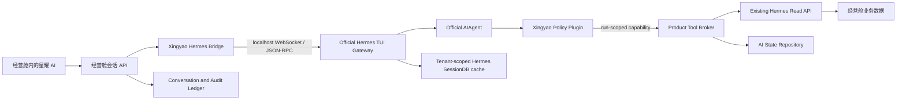

# 星耀 AI：Hermes 原生智能恢复设计

## 状态

- 设计状态：已确认，等待书面规格复核
- 产品基线：`origin/codex/full-project-ui` at `d8e066c`
- 集成选择：方案 B，直接接入官方 TUI Gateway
- 官方基线：Hermes Agent `v2026.7.20`（v0.19.0，签名发布标签，短提交 `3ef6bbd`）
- 产品名称：继续使用“星耀 AI”

## 背景

当前星耀 AI 已经通过自研 `/v1/xingyao/runs` 适配层调用 Hermes 的 `AIAgent`，并完成只读经营数据接入、组织隔离、角色权限和 Skill 授权。但现有生产配置为了收紧权限，同时关闭或绕过了 Hermes 的多项原生智能机制：原生 SessionDB、长期记忆、完整上下文文件、Todo、Clarify、委派、更多原生工具以及更长的 Agent Loop。产品端还只向 Runtime 传递裁剪后的用户/助手文本，没有完整工具轨迹，也没有把 Fast/Deep 模式传入 Runtime。

结果是安全边界基本成立，但“无业务操作权限”被扩大成了“无记忆、无计划、无学习、无委派”，实际体验明显弱于原版 Hermes。

本设计恢复官方 Hermes 的原生智能内核，同时保持一条不可突破的边界：Hermes 可以读授权经营数据，可以写自己的会话、个人记忆和 Skill 草稿，但永远不能修改经营舱业务数据。

## 目标

1. 以官方 Hermes TUI Gateway 和 `AIAgent` 为执行核心，不重写 Agent Loop。
2. 恢复原生上下文装配、压缩、Session、Todo、Clarify、Skills、个人记忆和只读子智能体。
3. 当前模型和供应商保持不变；Fast/Deep 只改变推理预算和并行能力。
4. 经营数据继续按需读取，不把整个经营舱数据批量塞进模型上下文。
5. 所有状态和数据严格按组织、用户、角色、会话和读取范围隔离。
6. 以并行部署和运行时开关完成无停机切换，并保留可验证的回滚路径。

## 非目标

- 不更名产品，不增加第二套面向用户的 Hermes 产品或登录体系。
- 不切换到混元、OpenRouter 或其他模型，也不做静默模型回退。
- 不开放项目、主播、报数、结算、权限或知识库写操作。
- 第一阶段不开放通用 MCP、Cron、消息发送、Home Assistant、浏览器点击或主机终端。
- 第一阶段不开放图片生成或其他可能产生额外外部费用的能力。
- 不允许 Gateway 直接连接 Supabase，也不向 Gateway 注入业务数据库凭证。
- 在新链路完成验收前，不删除现有 `/v1/xingyao/runs` 回滚路径。

## 决策与被否决方案

### 已选：直接接入官方 TUI Gateway

经营舱后端通过本机 WebSocket/JSON-RPC 接入官方 TUI Gateway，由 Gateway 驱动原生 `AIAgent`。星耀只在官方扩展边界增加身份绑定、工具策略、状态后端和事件映射，不复制官方推理循环。

选择该方案的原因是它最大程度保留官方 Session、压缩、委派、流式事件和后续升级能力，也能利用 v0.19.0 的 Gateway 持久交付与多 Profile 隔离基础。

### 未选：继续扩展当前自研 Run API

该方案迁移成本最低，但会继续由自研适配层决定上下文、事件和工具能力，最容易再次出现“核心仍是 Hermes，体验却不像 Hermes”的问题。

### 未选：重新实现一套类 Hermes 内核

该方案会复制 Agent Loop、Session、压缩、工具编排和委派逻辑，长期性能、稳定性和官方兼容性都会下降，不符合“在官方源码基础上改造”的目标。

## 总体架构



### 组件职责

**经营舱会话 API**

- 负责登录、组织、角色、会话所有权、轮次租约和幂等校验。
- 保存用户消息、助手消息、工具消息、上下文快照和最终结果。
- 浏览器永远不直接连接 Gateway。

**Xingyao Hermes Bridge**

- 把产品会话映射到 Hermes Session。
- 为每轮冻结 Actor Context、页面上下文、Skill 授权和模式预算。
- 映射 Gateway 事件到现有产品流式协议。
- 负责中断、重连、Session 重建和版本兼容握手。

**官方 TUI Gateway 与 AIAgent**

- 保留官方 Agent Loop、上下文压缩、Session、工具编排、Todo、Clarify 和委派实现。
- 不持有 Supabase 凭证、产品服务令牌或 Actor 私钥。
- 仅监听 `127.0.0.1`，不向公网暴露。

**Xingyao Policy Plugin**

- 在 Session 创建、恢复、Prompt 提交和每次工具调用前校验不可变 Actor Context。
- 只注册经过批准的工具集合。
- 约束子智能体继承相同权限、网络和预算。

**Product Tool Broker**

- 接收仅对单次 invocation 有效的 opaque capability。
- 每次调用重新校验 invocation、组织、用户、角色、scope、Skill grant 和轮次租约。
- 为现有 Read API 生成新的短效 Actor assertion；Gateway 不复用或保存产品私钥。
- 仅向 AI 状态仓库开放明确允许的写操作。

## 版本与源码策略

1. 新 Runtime 从官方签名标签 `v2026.7.20` 建立，不追随浮动 `main`。
2. Fork 必须记录 `upstreamTag`、完整 upstream commit、fork commit、`protocolVersion` 和 `profileVersion`。
3. 对官方核心的改动只允许发生在可审计扩展点：Gateway Bridge、Policy Plugin、Xingyao tools、状态适配器和部署配置。
4. 不修改官方 Agent Loop 的推理决策、压缩算法或委派算法；若确需修改，必须单独形成架构决策记录和同模型基准证明。
5. Gateway `/healthz` 返回版本和 capability 清单；产品发现协议或 profile 不兼容时拒绝流量，不做猜测性兼容。
6. 官方升级按“新标签 -> 差异审计 -> 同模型基准 -> 隔离测试 -> Canary”执行，不直接把 upstream `main` 合入生产。

## 身份、权限与信任边界

### Actor Context

每轮执行由产品生成不可变 Actor Context，至少包含：

- `organizationId`
- `userId`
- `role`
- `conversationId`
- `invocationId`
- `allowedReadScopes`
- `enabledSkillVersions`
- `skillGrantsHash`
- `pageContext`
- `profileVersion`
- `iat`、`exp`、`jti`

Actor Context 使用 RS256 签名，寿命不超过 300 秒。签名和过期时间在 Session 创建、恢复和 Prompt 接纳时验证；已接纳轮次只保留不可变 claims，过期 JWS 不能用于新请求或重连。执行中的每次工具调用不依赖旧 JWS 继续授权，而由 Tool Broker 根据服务端轮次租约和当前角色重新鉴权，因此 Deep 模式不会在临近 300 秒时绕过或意外放宽权限。Gateway Session ID 只是运行标识，永远不能代替身份或权限凭证。

### 双重检查

1. Gateway Policy Plugin 先检查工具是否在当前 Actor 的允许集合中。
2. Product Tool Broker 再根据服务端保存的轮次租约和 Actor 快照检查一次。
3. Read API 继续执行现有组织、角色和 scope 校验。
4. Actor fingerprint 发生变化，包括角色降级、scope 缩减或 Skill 版本变化时，现有 Runtime Session 失效并按新权限重建。
5. Session 或资源归属不匹配时返回统一的无权限/不存在结果，不泄露资源是否存在。

### 凭证隔离

- 模型凭证只存在于 Gateway 的受控 provider 配置中。
- 产品 Read API 服务令牌和 Actor 私钥只存在于产品服务端。
- Gateway 使用单 invocation capability 调用 Tool Broker，该 capability 不能直接调用业务 API。
- Gateway 环境中不得存在 Supabase URL、service role key 或产品数据库密码。

## 能力矩阵

| 能力                           | 决策   | 约束                                          |
| ------------------------------ | ------ | --------------------------------------------- |
| 官方 Agent Loop                | 恢复   | 不修改核心推理循环                            |
| 原生上下文压缩                 | 恢复   | 压缩结果同步到产品会话摘要                    |
| SOUL 与角色上下文              | 恢复   | 使用“星耀 AI”身份，不覆盖安全策略             |
| Session 恢复、分支、搜索、摘要 | 恢复   | 必须绑定组织、用户和会话                      |
| 个人记忆                       | 恢复   | 仅组织+用户私有，禁止经营事实沉淀             |
| Todo、Clarify                  | 恢复   | Clarify 映射为产品可交互事件                  |
| 官方 Skills 渐进加载           | 恢复   | 只加载签名且已授权版本                        |
| Skill 创作                     | 仅草稿 | 人工审批后才能发布和启用                      |
| 子智能体                       | 恢复   | 只读、最多 3 个并行、最大嵌套 2 层            |
| Web search/extract             | 恢复   | 只读、SSRF 防护、内网禁止、外部内容不可信标记 |
| 隔离计算                       | 恢复   | 临时沙箱、无网络、无秘密、无业务挂载          |
| 附件与视觉读取                 | 恢复   | 仅允许本轮已授权附件目录                      |
| 经营数据工具                   | 保留   | 只能经 Tool Broker 和 Read API 按需读取       |
| 主机终端、任意文件写入         | 禁止   | 仅隔离沙箱内部临时文件例外                    |
| 浏览器点击与业务自动化         | 禁止   | 不产生外部或业务副作用                        |
| 项目、主播、结算、权限写入     | 禁止   | 网络、凭证、工具注册三层不可达                |
| Cron、消息发送、Home Assistant | 禁止   | 不进入第一阶段工具注册表                      |
| 通用 MCP                       | 延后   | 后续只允许经过审计的只读 MCP                  |
| 图片生成和付费外部动作         | 延后   | 需另行预算和审批设计                          |

## 状态模型与数据隔离

### 三层状态

**会话记忆**

- 只属于当前 `organizationId + userId + conversationId`。
- 包含用户、助手、工具消息、证据引用、上下文快照和摘要。
- 继续复用 `ai_conversations`、`ai_chat_messages`、`ai_chat_turns`。

**个人记忆**

- 只属于 `organizationId + userId`，跨会话可用，跨组织或跨用户不可见。
- 只保存表达偏好、工作习惯、分析偏好和用户明确要求记住的非经营事实。
- 不保存项目、主播、结算、金额、经营指标、组织知识正文、权限信息或密钥。

**组织知识**

- 继续使用现有 `knowledge_documents` 和 `knowledge_document_chunks`。
- 只能通过现有只读工具检索。
- Hermes 不能新增、修改、删除或把组织知识复制进个人记忆。

### 产品数据库是权威数据源

- 产品 PostgreSQL 是会话、消息、轮次、个人记忆、Skill 草稿和审计记录的唯一权威源。
- 官方 SessionDB 恢复启用，但只作为租户隔离的运行缓存。
- Runtime profile key 使用服务端 HMAC 从 `organizationId + userId` 派生，路径不暴露原始 ID。
- 不允许所有用户共享 `~/.hermes/sessions`、`~/.hermes/memories` 或可变 Skill 目录。
- Gateway 缓存丢失后，Bridge 从产品账本重放同一 Actor 可见的消息和脱敏工具轨迹，创建新的 Hermes Session。

### `ai_conversations.provider_state`

该字段保存派生的 Runtime 映射，不保存秘密：

```json
{
  "hermesGateway": {
    "upstreamTag": "v2026.7.20",
    "protocolVersion": "xingyao-hermes-gateway-v2",
    "profileVersion": "hermes-xingyao-v2",
    "sessionId": "runtime-session-id",
    "generation": 1,
    "actorFingerprint": "sha256",
    "checkpointTurnId": "uuid",
    "lastSyncedSequence": 12
  }
}
```

### `ai_hermes_memories`

新增专用个人记忆表，核心字段为：

- `id`, `organization_id`, `owner_user_id`
- `memory_type`: `preference | workflow | communication | user_instruction`
- `content`, `content_hash`, `revision`, `active`
- `source_conversation_id`, `source_message_id`, `source_invocation_id`
- `created_at`, `updated_at`, `deactivated_at`

约束：

- 唯一归属键始终包含组织和用户。
- RLS 只允许本人读取；写入只经受控 RPC/Repository。
- `source_message_id` 必须指向同一用户的用户消息，禁止以工具结果或助手生成文本作为记忆来源。
- 服务端类别校验和业务数据防泄漏规则拒绝金额、业务对象 ID、工具 evidence、知识库正文和秘密。
- 写入采用 `invocationId + contentHash` 幂等；更新形成 revision，不做不可审计覆盖。
- 新记忆从下一轮上下文快照开始生效，不 retroactively 改变正在运行的 Agent Loop。

### `ai_hermes_skill_drafts`

新增专用 Skill 草稿表，核心字段为：

- `id`, `organization_id`, `owner_user_id`
- `skill_id`, `version`, `manifest`, `bundle`, `bundle_sha256`
- `status`: `draft | pending_review | approved | rejected | superseded`
- `source_conversation_id`, `source_invocation_id`
- `reviewed_by`, `reviewed_at`, `review_note`
- `created_at`, `updated_at`

Hermes 只能创建或更新自己的 `draft`。提交审核、批准、拒绝和发布由产品工作流完成。只有具有 Skill 审批权限的人员才能批准；批准后生成签名 bundle 并进入现有 Skill grant 计算。Hermes 不能自行安装、启用、覆盖或删除已发布 Skill。

### 审计

- 会话工具轨迹以 `role = tool` 写入 `ai_chat_messages`，保存脱敏参数、结果摘要、`evidenceRefs`、`missingData` 和观测时间。
- 调用审计继续复用 `ai_invocations`；只读经营工具继续写入数据库已强制 `read_only = true` 的 `ai_tool_invocations`。
- 个人记忆写入由不可覆盖的 memory revision、source invocation 和对应 `role = tool` 消息审计；Skill 草稿写入由草稿版本和审核生命周期审计。两类 AI 状态写入不得伪装成 `ai_tool_invocations` 中的只读业务工具。
- 子智能体记录 parent invocation、继承的 Actor fingerprint、预算、工具调用和终态。
- 不在审计中保存密钥、完整 JWS、模型内部思维链或未脱敏外部页面正文。

## Prompt 与上下文装配

Prompt 按以下稳定顺序装配：

1. 官方 Hermes system prompt 与 Agent Loop 协议。
2. 不可覆盖的星耀安全策略和工具边界。
3. “星耀 AI” SOUL 与产品角色说明。
4. 当前 Actor、角色、读取 scope、页面定位和模式预算。
5. 当前个人记忆快照。
6. 已批准 Skills 的索引；Skill 正文按官方渐进加载机制按需读取。
7. 当前产品会话和同 Actor 可见的脱敏工具轨迹。

页面上下文只提供 `pageType` 和对象 ID 等定位信息。项目、主播、结算、知识库等真实经营数据由 Agent 根据任务按需调用只读工具，不预先批量注入 Prompt。

外部网页、附件、知识库和工具输出都作为不可信数据内容处理，不能覆盖 system policy、Actor Context 或工具权限。

## 单轮执行流程

1. 浏览器向经营舱会话 API 提交消息、conversation 和 `fast | deep` 模式。
2. 产品校验登录、组织、角色、会话所有权和幂等键，创建 `ai_chat_turn` 并取得轮次租约。
3. Context Engine 冻结 Actor、页面上下文、Skill grants、个人记忆版本和模式预算。
4. Bridge 与 Gateway 完成版本握手，创建或恢复绑定 Actor 的 Hermes Session。
5. Bridge 提交 Prompt；Gateway 使用官方 AIAgent 开始原生循环。
6. 每次工具调用先经过 Policy Plugin，再通过单 invocation capability 进入 Tool Broker。
7. Tool Broker 重新鉴权，并按类型调用 Read API、个人记忆仓库或 Skill 草稿仓库。
8. 工具结果返回 Gateway，同时写入产品工具消息和审计记录。
9. 子智能体只能从父 invocation 派生，继承完全相同的 Actor、scope 和只读工具集合。
10. Gateway 的文本、工具进度、Clarify、Todo、子任务状态和终态映射到产品 SSE。
11. 最终助手消息、证据、缺失项、使用量、摘要和 Runtime checkpoint 原子化落账。
12. 用户停止生成时，Bridge 调用原生 `session.interrupt`，结束子任务并将轮次标记为 cancelled。

产品不向用户展示模型私有思维链。界面只展示简短的任务进度、工具名称、数据来源、可解释结论和最终答案。

## Fast 与 Deep 模式

两个模式使用部署中同一个 provider/model 配置。模式不得改变组织权限、工具集合或数据范围。

| 配置            | Fast                   | Deep                               |
| --------------- | ---------------------- | ---------------------------------- |
| Agent Loop 上限 | 24 次                  | 90 次                              |
| 墙钟时间上限    | 90 秒                  | 300 秒                             |
| 子智能体并行数  | 最多 1 个              | 最多 3 个                          |
| 子智能体嵌套    | 1 层                   | 最多 2 层                          |
| Todo/计划       | 可按需使用             | 复杂任务默认使用                   |
| 交叉验证        | 单路径优先             | 多数据源与多子任务交叉验证         |
| 适用任务        | 查询、总结、单项目分析 | 经营诊断、复杂归因、结算分析、复盘 |

所有限制都在服务端执行，前端标签不是能力开关。达到预算时，Agent 应基于已有证据给出受限结论和 missingData，而不是丢弃整轮结果。

## 工具安全策略

### 经营数据工具

- 只能注册现有批准的 `xingyao_*` 只读工具。
- 工具必须声明 required scope、输入 schema、输出 schema、最大返回量和审计标签。
- Agent 无法访问 Read API 的通用 URL，只能按注册工具名调用 Tool Broker。
- 返回结果必须带 `evidenceRefs`、`sourceLabels`、`updatedAt`、`missingData` 和 permission denials。

### Web 工具

- 只允许 HTTP/HTTPS 公网地址。
- 拒绝 loopback、link-local、RFC1918、云 metadata、DNS rebinding 和重定向到内网。
- 限制响应大小、内容类型、重定向次数和超时。
- 网页文本标记为 untrusted content，不能成为权限指令。

### 隔离计算

- 仅提供数学、表格转换和结果验证所需的临时沙箱。
- 沙箱无网络、无宿主凭证、无产品源码写权限、无业务数据挂载。
- 输入只能来自本轮已授权工具结果，输出必须经过大小和类型限制。
- 沙箱结束后销毁临时状态。

### 子智能体

- 全局最多 3 个并行，最大嵌套 2 层。
- 每个子智能体继承父 Actor fingerprint 和精确只读工具集合，不能扩大 scope。
- 子智能体不能调用个人记忆写入或 Skill 草稿写入工具；只有父 Agent 可以在主轮次内发起允许的 AI 状态写入。
- 只能返回分析、证据和 missingData，不能产生业务动作。
- 背景任务完成事件必须验证父 invocation 所有权后才能交付。

## 错误与降级语义

### 结果状态

- `complete`：任务完成，关键数据可用。
- `partial`：部分工具或数据源失败，但仍有足够可靠证据形成受限结论。
- `blocked`：完成任务所需的关键数据全部缺失或权限不足。
- `failed`：模型、Gateway、协议或内部执行发生不可恢复错误。
- `cancelled`：用户主动中断。

这些是 response metadata 的业务结果，不要求扩大现有 `ai_chat_turns.status` 枚举；`partial` 和 `blocked` 可以作为已完成回复的 outcome 保存。

### 处理规则

- 单个工具失败只记录该工具的 missingData，不得直接宣称全部“上游不可用”。
- 仅在完成任务所需的所有关键读取均失败时使用 `blocked/upstream_unavailable`。
- 历史会话数据必须标注原始观测时间，不得冒充当前实时数据。
- 权限拒绝不重试，也不能通过其他工具绕过。
- 只读、幂等调用采用有限退避重试；个人记忆和 Skill 草稿依靠 invocation 幂等键去重。
- Provider 失败只重试当前模型的安全请求，不自动切换混元或其他模型。
- `failed` 返回稳定错误码和 `traceId`，日志保存内部原因但不向用户泄露秘密或堆栈。
- 不做单轮静默 Legacy fallback，避免重复计费、重复状态和行为漂移；回滚只能由服务端运行时开关统一执行。

## 部署与迁移

### 并行拓扑

- 当前 Runtime `/v1/xingyao/runs` 继续运行在现有本机端口，作为 Legacy 回滚通道。
- 新官方 TUI Gateway 以独立 systemd 服务并行运行，建议初始绑定 `127.0.0.1:8643`。
- 产品通过 server-only 环境变量和 allowlist 选择执行链路，不使用 `NEXT_PUBLIC_*` 决定后端安全行为。
- 用户仍只看到经营舱中的“星耀 AI”，没有第二套入口或配置页面。

### 迁移顺序

1. 固定官方 tag、生成 fork provenance 和同模型基准集。
2. 添加 AI 状态迁移、Repository 和 RLS/幂等测试，默认不启用。
3. 构建 TUI Gateway、Policy Plugin、Tool Broker 协议和版本握手。
4. 在产品 Bridge 中实现 Session、事件、Clarify、中断和重建映射。
5. 双服务本机联调，完成安全、隔离、恢复和质量门禁。
6. 只对测试组织和指定账号开启 Gateway。
7. 扩大 allowlist，观察错误率、工具成功率、质量和资源占用。
8. 全量切换后保留 Legacy 一整个稳定观察窗口，再单独决定删除。

### 运行时开关

- `XINGYAO_HERMES_GATEWAY_ENABLED`
- `XINGYAO_HERMES_GATEWAY_ALLOWLIST`
- `XINGYAO_HERMES_GATEWAY_BASE_URL`
- `XINGYAO_HERMES_LEGACY_RUNTIME_ENABLED`

开关只存在于产品服务端。新链路关闭后，新会话回到 Legacy；已经运行的 Gateway 轮次先中断并完成状态落账，不能在半轮中切换执行器。

## 回滚

回滚不删除数据，也不回滚已应用的加法迁移：

1. 关闭 `XINGYAO_HERMES_GATEWAY_ENABLED`。
2. 保持 `XINGYAO_HERMES_LEGACY_RUNTIME_ENABLED=true`。
3. 重启产品 PM2 服务，验证新请求进入 `/v1/xingyao/runs`。
4. 停止新 Gateway systemd 服务，但保留日志、状态缓存和版本清单用于调查。
5. 验证产品 `/api/health`、Legacy `/healthz` 和一轮只读会话。

个人记忆和 Skill 草稿是独立 AI 状态，不会影响业务表；Legacy 不读取它们，因此无需破坏性回滚。每次生产切换前生成带 SHA256 的代码、配置、systemd、状态 schema 和恢复脚本回滚包。

## 验收门禁

### 质量与原生能力

- 使用同一 provider、同一 model、同一提示集，对官方 Hermes 和星耀集成版执行至少 20 个代表性任务。
- 综合任务完成率相对官方基线下降不得超过 5 个百分点。
- Fast/Deep 的服务端预算、子智能体数量和实际执行轨迹必须不同。
- Session 恢复、分支、摘要、压缩、Todo、Clarify、Skills、个人记忆和子智能体均有真实端到端证据。
- 经营分析中的每个数字能追溯到 evidenceRef 和观测时间；无证据数字率为 0。

### 安全与隔离

- 覆盖所有产品角色、scope 和 Skill grant 的权限矩阵。
- 跨组织、跨用户、角色降级、Session ID 猜测和 capability 重放测试泄漏数为 0。
- 通过数据库写审计证明项目、主播、报数、结算、权限和知识库业务写入数为 0。
- 个人记忆不能保存工具数据、金额、业务 ID、知识库正文或秘密。
- 未批准 Skill 草稿不能出现在 active Skill 索引中。
- Web SSRF、附件越界、沙箱网络和子智能体 scope escalation 测试全部拒绝。

### 稳定性与恢复

- Gateway 在流式输出前、工具调用中、最终答案生成后分别崩溃时，产品账本都能恢复到确定状态。
- Gateway 重启后可以从产品会话重建 Session，不丢失已确认消息。
- 单个 Read API 工具失败时能返回 `partial`，而不是错误地报告全部上游不可用。
- 重复请求、网络重试和服务重启不会产生重复个人记忆、Skill 草稿或工具审计。
- 用户中断会终止父任务和子任务，不再继续消耗模型调用。

### 本地门禁

在 GitHub Actions 暂不可用期间，合并前至少执行：

- 产品：`git diff --check`
- 产品：`pnpm type-check`
- 产品：Hermes/AI focused tests 与新增隔离测试
- 产品：`pnpm build`
- Hermes fork：Python unit tests、Gateway protocol tests、policy tests
- 双服务：真实模型 + Read API 的本机端到端 smoke
- 部署：health、端口、版本握手、systemd、PM2、回滚演练

门禁脚本输出提交号、upstream tag、fork commit、产品 commit、模型标识、测试结果和 SHA256，并进入回滚包证据目录。

## 完成定义

只有同时满足以下条件，才可宣布“星耀 AI 的 Hermes 原生智能已恢复”：

1. 用户仍在经营舱内使用同一个“星耀 AI”，无需感知第二套产品。
2. 生产执行链路由固定版本的官方 TUI Gateway 和 AIAgent 驱动。
3. 当前模型保持不变，Fast/Deep 预算真实生效。
4. 官方 Session、压缩、Todo、Clarify、Skills、个人记忆和只读子智能体完成端到端验收。
5. 经营数据只能按 Actor 权限经 Read API 读取，所有业务写操作不可达。
6. 三层状态隔离、审计、失败语义、崩溃恢复和一键回滚全部通过门禁。

## 官方参考

- [Hermes Agent v0.19.0 release](https://github.com/NousResearch/hermes-agent/releases/tag/v2026.7.20)
- [Architecture](https://hermes-agent.nousresearch.com/docs/developer-guide/architecture)
- [Agent loop](https://hermes-agent.nousresearch.com/docs/developer-guide/agent-loop)
- [Prompt assembly](https://hermes-agent.nousresearch.com/docs/developer-guide/prompt-assembly)
- [Programmatic integration](https://hermes-agent.nousresearch.com/docs/developer-guide/programmatic-integration)
- [Tools](https://hermes-agent.nousresearch.com/docs/user-guide/features/tools)
- [Skills](https://hermes-agent.nousresearch.com/docs/user-guide/features/skills)
- [Memory](https://hermes-agent.nousresearch.com/docs/user-guide/features/memory)
- [Mixture of Agents](https://hermes-agent.nousresearch.com/docs/user-guide/features/mixture-of-agents)
