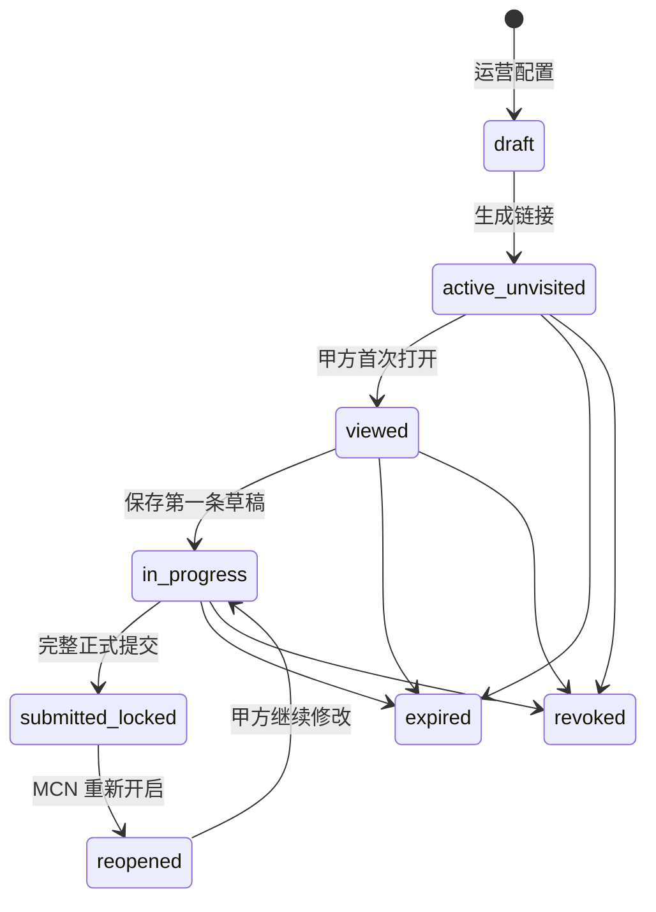

# 录屏分享业务闭环与使用逻辑优化设计

> 状态：设计已批准；Task 1–12 已在实现分支完成，尚未执行 live DB、合并、部署与生产验证
> 日期：2026-07-30
> 基线：`origin/codex/full-project-ui@3cdd65cf`
> 范围：MCN 运营端录屏分享、公开分享页、甲方复核、结果回流与录屏版本证据
> 本文保留已批准的产品与技术设计，并在末尾记录当前实现映射；推送、合并与部署仍以交付流程授权为准

## 1. 背景

现有录屏分享已经具备以下技术能力：

- `/share/admission/[token]` 公开分享路由；
- 私有原始上传优先、外部链接辅助；
- 访问码、访问会话、限流、过期和撤销；
- 公开 DTO 字段白名单；
- 甲方逐条提交 `selected`、`backup`、`rejected`、`needs_changes`；
- 录屏版本锁定和基础查看、提交时间记录；
- 桌面端和移动端的基本播放与失败回退。

但当前流程仍然更接近“生成一个能打开的链接”，尚未形成完整业务任务：

1. 运营点击后直接生成分享，不能主动确认本轮分享哪些录屏；
2. 有效期、访问码、只读/可提交等底层能力没有形成创建向导；
3. 可分享资格依赖会被甲方结果改变的当前状态，可能出现“某版本已经通过 MCN 内审，后续却无法再次分享”；
4. 甲方没有服务端草稿、完整提交门槛和提交后锁定；
5. 运营只能看到粗粒度分享状态，不能跟踪未访问、复核中、已提交和后续待办；
6. 单条视频异常容易被误解为整个分享不可用；
7. 缺少正式复核轮次、重开、历史结果快照和新版本重新发起逻辑。

本设计将录屏分享从“临时链接”升级为“可控的外部预览/正式复核任务”，同时保留现有项目优先、MCN 内审优先和人工最终确认边界。

## 2. 目标

### 2.1 产品目标

- 运营能够主动选择本轮分享的录屏和具体版本；
- 预览分享与正式复核使用同一套安全交付能力，但业务责任明确分离；
- 甲方可以中断后继续复核，只有完整确认后结果才正式生效；
- 正式提交后结果不可被无提示覆盖；
- MCN 能够看到分享进度、正式结果和明确的下一步动作；
- 已通过 MCN 内审的录屏版本不会因后续甲方结果而失去分享资格；
- 单条录屏异常不会阻止其他录屏正常分享和复核；
- 原始上传始终是权威播放源，外链仅作为显式备用来源；
- 所有影响业务状态的动作保持人工可控并具备审计证据。

### 2.2 成功标准

一个录屏分享任务必须回答以下问题：

- 谁创建了这次分享；
- 分享用于预览还是正式复核；
- 本轮具体分享了哪些录屏版本；
- 甲方是否已经打开、完成到哪里、是否正式提交；
- 正式结果是否已经锁定；
- MCN 下一步需要确认、通知修改还是发起新一轮；
- 视频播放失败时失败的是原始视频、外链还是单条录屏；
- 历史结果和后续新版本之间是什么关系。

## 3. 已确认的业务决策

1. 分享采用双模式：
   - **预览分享**：只读观看，不允许提交判断，不改变准入状态；
   - **正式复核**：逐条判断、服务端保存草稿、全部完成后一次正式提交。
2. 正式复核自动保存草稿，未全部判断完成时不得正式提交。
3. 正式提交后立即锁定；需要修改时由 MCN 重新开启或创建新一轮。
4. 运营必须能够主动选择本轮分享哪些录屏，不再默认全量加入。
5. 可分享资格绑定“某个录屏版本曾通过 MCN 内审”的不可变事实，不绑定后续会变化的当前执行状态。
6. 下游甲方的选入、备选、驳回或需要修改，不得抹掉录屏版本的 MCN 内审通过事实。
7. 某条录屏不可播放或不满足分享条件时，只阻止该条被选择，不得让整批分享创建失败。
8. 同一项目同时只允许一个进行中的正式复核轮次；预览分享可以存在多条。
9. `selected` 不自动入项，仍需 MCN 最终确认。
10. `backup` 必须可见且不改变录屏/申请状态。
11. `rejected` 和 `needs_changes` 必须填写原因，并形成主播可见的修改反馈。
12. 不新增甲方账号体系；同一正式分享链接代表同一甲方复核团队的一份共同结论。

## 4. 方案选择

### 4.1 方案一：只补界面

把现有有效期、访问码、撤销和状态字段展示出来，不改变提交语义。

优点：

- 改动范围小；
- 可以快速改善创建体验。

缺点：

- 无法解决状态耦合造成的再次分享失败；
- 没有服务端草稿、提交锁定和复核轮次；
- 仍然无法形成可靠的业务闭环。

### 4.2 方案二：受控业务闭环

保留现有 `project_applications`、`recording_submissions` 和准入主流程，在其上增加不可变内审事实、分享任务、草稿、正式结果修订和进度待办。

优点：

- 能覆盖本次确认的完整业务；
- 不需要建设独立外部账号或协作平台；
- 可以沿用现有安全、审计和录屏播放能力；
- 与当前项目优先的产品架构一致。

缺点：

- 需要新增明确的数据状态和迁移；
- 正式提交需要原子事务和并发控制；
- 运营界面需要从按钮升级为分享任务中心。

### 4.3 方案三：完整外部协作平台

为甲方增加账号、邀请、多人分工、评论和站内通知。

优点：

- 多人协作能力最完整。

缺点：

- 明显超出当前录屏分享场景；
- 增加账号、权限、通知和隐私治理成本；
- 会提高甲方临时查看录屏的使用门槛。

### 4.4 决策

采用**方案二：受控业务闭环**。

## 5. 核心领域模型

### 5.1 MCN 内审事实

为每个 `recording_submission_id + version` 保留不可变的 MCN 审核事实：

- 审核结果；
- 审核人；
- 审核时间；
- 审核备注；
- 审核时的录屏版本。

“当前录屏状态”可以继续用于驱动界面和后续动作，但不能作为判断某历史版本是否曾通过内审的唯一依据。

### 5.2 分享任务

一次分享任务至少包含：

- 项目；
- 分享名称和用途；
- `preview` 或 `formal_review` 模式；
- 生命周期状态；
- 有效期；
- 访问码要求；
- 是否允许显示备用外链；
- 创建人和创建时间；
- 最近访问时间；
- 草稿最近更新时间；
- 正式提交和锁定时间；
- 正式复核轮次号；
- 重开次数和最近重开原因。

### 5.3 分享项

每个分享项锁定：

- 应用/主播；
- 录屏提交 ID；
- 录屏版本；
- MCN 内审通过事实；
- 展示顺序；
- 创建时的来源可用性结果；
- 首选播放源类型；
- 是否允许显示备用外链。

分享项不保存短期签名 URL。每次播放由受保护的服务端路由重新解析。

### 5.4 复核草稿

正式复核草稿按分享项保存：

- 判断；
- 备注；
- 理由标签；
- 草稿修订号；
- 最近保存时间；
- 最近保存会话的非敏感标识。

草稿只属于分享任务，不改变录屏、申请、主播或项目状态。

### 5.5 正式提交快照

每次正式提交产生不可变快照：

- 提交修订号；
- 所有分享项的判断和原因；
- 项目级备注；
- 提交时间；
- 提交时的分享项版本集合；
- 结果汇总；
- 同步业务状态的执行结果；
- 锁定状态。

重新开启不会覆盖旧快照；再次提交会创建新的提交修订。

## 6. 可分享资格与主动选择

### 6.1 可分享录屏池

某个录屏版本满足以下条件时进入“可分享录屏池”：

1. 存在不可变的 MCN 内审通过记录；
2. 录屏记录未被删除、隔离或标记为不可公开；
3. 至少存在一个可解析的播放来源：
   - 私有原始上传；或
   - 合法的 HTTP/HTTPS 外部链接。

甲方结果不得改变条件 1。甲方驳回或要求修改后，该历史版本仍可被运营主动选择；运营界面需要同时显示该版本的历史甲方结果，避免误选。

### 6.2 录屏选择器

录屏选择器必须支持：

- 按主播、账号和版本搜索；
- 仅看可分享；
- 按原始视频、仅外链、来源异常筛选；
- 默认选择最新的“已通过内审”版本；
- 展开并选择已通过内审的历史版本；
- 全选当前筛选结果；
- 取消选择；
- 调整分享顺序；
- 单条预览；
- 显示最近一次甲方结果和最近分享时间。

页面固定显示：

- 已选择数量；
- 可分享数量；
- 异常数量；
- 仅外链数量。

### 6.3 单条失败隔离

创建分享时按分享项校验：

- 创建向导先调用逐条预检，返回每条录屏的 `ready`、`warning` 或 `blocked`，不能只返回一个整批错误；
- 不可分享的条目从已选集合中标红并要求移除或修复；
- 提供“一键移除异常并继续”，保留其余已选录屏和排序；
- 其他已选条目继续保留；
- 不因项目中存在未审核、待修改或无视频条目而拒绝整个分享；
- 最终创建只提交通过预检的 `applicationIds + recordingSubmissionIds + versions`，不得重新把项目全量录屏隐式加入；
- 如果预检后某条录屏状态发生变化，最终创建返回具体失效条目和原因，界面移除失效条目后可以继续，不清空其余配置。

## 7. 端到端业务流程

### 7.1 MCN 创建分享

#### 第一步：选择录屏

运营从录屏库主动勾选本轮录屏和具体版本。系统只对所选条目进行最终校验。

#### 第二步：设置分享

运营填写：

- 分享名称；
- 分享用途；
- 分享模式；
- 有效期，默认 7 天，最长 30 天；
- 是否启用访问码；
- 是否允许显示备用外链；
- 甲方操作说明。

正式复核默认启用访问码；预览分享可以关闭。

#### 第三步：甲方视角预览

运营在生成前验证：

- 分享路由可以打开；
- 原始视频可加载；
- 外链指向正确地址；
- 主播、录屏和版本对应正确；
- 当前模式下显示正确的只读或判断控件；
- 移动端布局不存在关键操作遮挡。

确认后生成分享令牌。

#### 第四步：交付

创建成功后提供：

- 复制链接；
- 复制访问码；
- 一键复制完整交付信息；
- 打开甲方视角；
- 撤销；
- 延长有效期。

完整交付信息包括分享名称、链接、访问码、截止时间和简短操作说明。访问码不得写入 URL。

分享令牌明文只在创建成功的当次响应中出现，离开结果弹窗后不能从数据库重新读取旧链接。若运营遗失链接，必须通过“重置分享链接”生成新令牌；重置需要二次确认，并立即让旧链接和旧访问会话失效。重置成功的当次响应再次提供一次复制完整交付信息的机会。

### 7.2 甲方预览

预览模式只允许：

- 查看项目说明；
- 搜索、筛选和切换录屏；
- 播放原始视频；
- 在允许时打开备用外链；
- 反馈单条视频无法播放。

预览模式不创建判断草稿、不显示提交按钮、不改变任何准入状态。

### 7.3 甲方正式复核

正式复核支持：

- 按“待判断、已选入、备选、需修改、已驳回”筛选；
- 上一条/下一条切换；
- 每条选择判断；
- 填写备注和理由标签；
- 自动保存；
- 显示保存中、已保存、保存失败；
- 显示 `已完成 X/Y`；
- 全部完成后进入结果汇总；
- 二次确认后正式提交。

`rejected` 和 `needs_changes` 必须填写原因。`selected` 和 `backup` 可以填写备注。

### 7.4 正式提交

正式提交必须原子完成以下检查和写入：

1. 分享仍然有效且未撤销；
2. 分享模式允许正式提交；
3. 所有分享项均有非 `pending` 判断；
4. 所有负向判断均有原因；
5. 所有草稿保存成功；
6. 客户端提交的录屏版本与分享项锁定版本一致；
7. 草稿修订号未发生并发冲突；
8. 创建正式结果快照；
9. 同步允许同步的业务结果；
10. 写入提交、锁定和审计时间。

任何一步失败，整轮结果不生效。

提交成功后，公开页切换为只读回执，甲方无法继续修改。

### 7.5 MCN 结果回流

- `selected`：进入“待 MCN 最终确认”，不得自动入项；
- `backup`：保留结果和备注，不改变当前申请/录屏状态；
- `rejected`：同步拒绝原因并形成运营待办；
- `needs_changes`：形成主播可见的 `recordingFeedback`，进入等待修改；
- 主播提交新版本后，先经过 MCN 内审，再由运营创建新一轮正式复核。

## 8. 生命周期与状态

### 8.1 正式复核任务

用户界面文案：

- 未发送；
- 未访问；
- 已访问；
- 复核中；
- 已提交并锁定；
- 已重新开启；
- 已过期；
- 已撤销。

### 8.2 预览任务

预览任务只包含：

`未访问 → 已访问 → 已过期/已撤销`

### 8.3 并行规则

- 同一项目只能有一个非过期、非撤销、非锁定的正式复核轮次；
- 已提交并锁定的正式轮次不阻止创建下一轮；
- 预览任务可以多条并存，每条必须有清晰名称和用途；
- 创建新正式轮次时，系统提示当前是否存在进行中的正式任务；
- 不允许两个正式任务同时写入互相冲突的甲方结果。

## 9. 运营端信息架构

项目准入模块增加“录屏分享中心”，包含三个页签。

### 9.1 录屏库

列表列项：

- 选择框；
- 主播和账号；
- 录屏版本；
- MCN 内审结果与时间；
- 来源健康度；
- 时长；
- 最近甲方结果；
- 最近分享时间；
- 单条预览。

来源健康度统一显示：

- 原始视频正常；
- 原始视频正常，外链备用；
- 仅外链可用；
- 视频源异常；
- 新版本待内审。

### 9.2 分享任务

任务列表展示：

- 分享名称；
- 模式；
- 录屏数量；
- 生命周期；
- 草稿完成度；
- 创建人和创建时间；
- 有效期；
- 最近访问时间；
- 正式提交时间。

任务操作：

- 查看任务详情；
- 重置分享链接并复制新的交付信息；
- 延期；
- 撤销；
- 重新开启；
- 基于本轮创建下一轮；
- 查看历史提交快照。

### 9.3 结果待办

待办类型：

- 待 MCN 最终确认；
- 需要通知主播修改；
- 等待主播重新提交；
- 新版本待内审；
- 可以发起下一轮；
- 视频无法播放待处理；
- 已完成。

每条待办必须有明确负责人、来源任务、主播、录屏版本和下一步动作。

## 10. 甲方端信息架构

### 10.1 桌面端

采用三段式布局：

- 左侧：录屏列表、搜索、筛选和完成状态；
- 中间：播放器、主播和录屏版本；
- 右侧：判断、原因、理由标签和草稿状态。

主要操作始终可见：

- 上一条；
- 下一条；
- 只看待判断；
- 保存状态；
- 结果汇总；
- 正式提交。

### 10.2 移动端

使用纵向流程：

`录屏列表抽屉 → 视频播放器 → 判断区 → 固定下一条/提交操作栏`

要求：

- 关键控件最小触控高度 44px；
- 播放器不被固定操作栏遮挡；
- 判断、备注和下一条可以单手完成；
- 切换录屏前触发草稿保存；
- 页面离开时提示尚未保存的内容。

### 10.3 提交后回执

回执展示：

- 分享名称；
- 提交时间；
- 选入、备选、驳回、需要修改数量；
- 每条正式结果；
- 当前已锁定说明；
- 如需修改，请联系 MCN 重新开启的提示。

## 11. 草稿、并发与锁定

### 11.1 服务端草稿

- 每次判断变化立即保存；
- 备注输入采用短暂防抖后保存；
- 保存失败保留本地输入并自动重试；
- 刷新或换设备后从服务端继续；
- 草稿不触发任何业务状态同步。

### 11.2 团队共享草稿

同一正式链接代表同一甲方团队的共同结论，所有有效访问会话读取同一份草稿。

草稿保存携带 `revision`：

- 修订号一致：保存成功并递增；
- 修订号过期：返回冲突；
- 客户端展示“其他人更新了本轮结果”，要求刷新并展示变化；
- 禁止静默覆盖。

### 11.3 锁定

正式提交后：

- 草稿停止写入；
- 正式结果不可修改；
- 播放和结果回执仍可在有效期内查看；
- 只有具备权限的 MCN 操作员可以重新开启；
- 重新开启必须填写原因并形成审计事件。

## 12. 重新开启与新一轮

### 12.1 重新开启

适用于误操作或小范围修正：

- 保留上一正式提交快照；
- 记录重开人、时间和原因；
- 以最近一次正式结果初始化新草稿修订；
- 甲方再次完整提交；
- 生成新的正式结果快照。

### 12.2 新一轮

适用于候选范围、录屏内容或版本变化：

- 重新进入录屏选择器；
- 可以沿用上一轮分享项；
- 可以替换为新近通过 MCN 内审的版本；
- 创建独立链接、有效期、草稿和结果；
- 原轮次永久只读。

## 13. 视频加载与来源策略

### 13.1 播放顺序

1. 有私有原始上传时，通过 token/访问会话保护的服务端播放路由加载；
2. 原始视频加载失败时显示错误、重试和诊断反馈；
3. 存在合法外链且运营允许展示时，显示“打开备用视频”；
4. 只有外链时明确标记“仅外链可用”；
5. 两种来源都不可用时，仅当前分享项显示异常。

### 13.2 禁止行为

- 不把访问码写入视频 URL；
- 不把私有存储路径返回给公开页面；
- 不静默把外链伪装成原始上传；
- 不因单条播放失败让整个分享路由进入错误页；
- 不使用新上传版本静默替换本轮锁定版本。

### 13.3 播放失败反馈

甲方可以对单条录屏提交“无法播放”反馈。记录：

- 分享任务和分享项；
- 失败时间；
- 原始/备用来源类型；
- 浏览器和设备类型；
- 稳定错误码；
- 不包含原始 IP、访问码、令牌或私有存储路径。

运营端生成对应待办。

## 14. 错误与恢复

公开页面使用稳定错误码和中文文案：

- `SHARE_NOT_AVAILABLE`
- `SHARE_EXPIRED`
- `SHARE_REVOKED`
- `ACCESS_CODE_REQUIRED`
- `ACCESS_CODE_INVALID`
- `ACCESS_RATE_LIMITED`
- `RECORDING_NOT_SHARED`
- `RECORDING_SOURCE_UNAVAILABLE`
- `DRAFT_CONFLICT`
- `DRAFT_SAVE_FAILED`
- `REVIEW_INCOMPLETE`
- `REVIEW_VALIDATION_FAILED`
- `REVIEW_ALREADY_LOCKED`
- `REVIEW_REOPEN_REQUIRED`
- `SHARE_SERVICE_UNAVAILABLE`

恢复原则：

- 能重试的错误提供重试；
- 单条错误停留在单条；
- 草稿错误不清空用户输入；
- 已锁定错误跳转到回执；
- 过期和撤销同时禁止读取数据与播放视频；
- 未知底层异常只记录在服务端。

## 15. 安全、隐私与审计

- 分享令牌使用高熵随机值，数据库只保存哈希；
- 明文分享令牌只在创建时返回一次；
- 历史任务不提供旧令牌读取；重置链接时轮换 token 哈希并撤销旧访问会话；
- 访问码使用带随机盐的强哈希；
- 访问码不进入 URL、历史记录和前端日志；
- 访问码验证继续使用服务端会话和原子限流；
- 正式复核默认要求访问码；
- 公开 DTO 使用显式字段白名单；
- 不返回复核人联系方式、组织内部标识、存储路径、token 哈希或无关主播隐私；
- 撤销后立刻让公开数据和播放路由失效；
- 创建、访问、草稿、提交、重开、撤销、延期和播放失败反馈均写审计；
- 甲方结果不得自动触发入项、财务、结算或证据金额变更。

## 16. 数据与接口影响

本节只定义实施方向，不规定最终迁移名称。

### 16.1 数据层

需要补充或明确：

- 按录屏版本保存的不可变 MCN 内审记录；
- 分享模式、用途和正式轮次；
- 分享任务生命周期；
- 分享项锁定的录屏版本和来源策略；
- 服务端草稿及修订号；
- 不可变正式提交快照；
- 重开事件和原因；
- 单条播放失败反馈；
- 同项目进行中正式任务的唯一性约束。

现有分享表、分享项表、甲方结果表和访问会话应优先演进，不另建平行准入系统。

### 16.2 运营接口

需要覆盖：

- 查询可分享录屏池；
- 创建前逐条预检并返回条目级状态和原因；
- 创建预览/正式分享；
- 查询分享任务列表和进度；
- 延期；
- 撤销；
- 重新开启；
- 基于历史轮次创建新一轮；
- 查询正式提交快照和结果待办。

### 16.3 公开接口

需要覆盖：

- 获取公开分享快照；
- 获取受保护的原始视频播放源；
- 读取草稿；
- 保存单条草稿并校验修订号；
- 原子正式提交；
- 获取锁定回执；
- 提交单条播放失败反馈。

公开接口不能泄漏底层表错误或内部字段。

## 17. 分阶段范围

### P0：业务闭环

- 不可变 MCN 内审通过事实；
- 主动选择录屏和版本；
- 双模式；
- 创建向导；
- 服务端草稿；
- 完整原子提交；
- 提交锁定；
- 单一进行中正式轮次；
- 运营分享任务和结果待办；
- 单条视频失败隔离；
- 原始视频优先与备用外链。

### P1：运营效率

- 基于历史轮次快速创建；
- 重开修订差异；
- 创建或重置链接成功后的当次一键复制交付信息；
- 播放失败待办；
- 更完整的访问、草稿和提交进度；
- 移动端复核优化。

### P2：增强能力

- 站外消息模板；
- 更细的复核时长和完成漏斗；
- 多语言；
- 在不引入甲方账号的前提下进一步改善多人共同复核体验。

## 18. 验收标准

### 18.1 主动选择与资格

1. 运营可以主动选择任意数量的可分享录屏；
2. 不再默认把项目全部录屏隐式加入；
3. 未选中的异常录屏不会阻止创建；
4. 已选中的异常录屏只阻止该条，并指出修复原因；
5. 运营可以一键移除异常条目，其他选择、排序和分享设置保持不变；
6. 曾通过 MCN 内审的录屏版本不会因后续甲方结果失去分享资格；
7. 分享始终加载所选具体版本；
8. 新版本不会静默替换历史分享项。

### 18.2 双模式

9. 预览分享不显示判断和提交；
10. 预览分享不会写入业务结果；
11. 正式复核支持逐条判断和服务端草稿；
12. 模式在创建后不可被静默切换。

### 18.3 草稿与提交

13. 刷新或换设备后可以恢复草稿；
14. 未全部判断时不能正式提交；
15. 负向结果缺少原因时不能提交；
16. 并发修改不能无提示互相覆盖；
17. 正式提交要么全部成功，要么全部不生效；
18. 提交后甲方不能继续修改；
19. MCN 重开后保留上一提交快照和重开原因。

### 18.4 结果回流

20. `selected` 只进入待 MCN 最终确认；
21. `backup` 可见且不改变当前状态；
22. `rejected` 和 `needs_changes` 保留原因；
23. `needs_changes` 形成主播可见反馈；
24. 新版本先内审，再进入新一轮正式复核。

### 18.5 播放与安全

25. 有原始上传时优先播放原始视频；
26. 原始视频失败时明确提供重试和备用外链；
27. 单条失败不影响其他录屏；
28. 过期或撤销后，公开数据和播放接口同时失效；
29. 访问码不出现在 URL；
30. 公开 DTO 不包含存储路径、token 哈希和内部 PII；
31. 桌面端和移动端均可完成观看、草稿和提交。

### 18.6 运营可见性

32. 运营能区分未访问、已访问、复核中和已提交；
33. 运营能看到草稿完成度和提交时间；
34. 运营能从结果待办直接进入下一步动作；
35. 运营能查看每次正式提交快照和重开历史；
36. 运营能识别并处理单条视频播放失败。

## 19. 测试策略

实施时必须采用小步 TDD：

- 领域服务测试：
  - 不可变内审事实；
  - 主动选择和单条失败隔离；
  - 正式轮次唯一性；
  - 草稿修订冲突；
  - 原子提交和锁定；
  - 重开和新一轮；
  - 结果回流规则。
- 路由测试：
  - 创建参数白名单；
  - 访问码会话；
  - 草稿读取/保存；
  - 并发冲突；
  - 完整提交；
  - 过期和撤销；
  - 私有视频播放；
  - 公开 DTO 隐私。
- 客户端测试：
  - 录屏选择器；
  - 三步创建向导；
  - 双模式；
  - 自动保存状态；
  - 完整提交门槛；
  - 锁定回执；
  - 来源失败回退；
  - 桌面和移动布局。
- 数据库契约测试：
  - 不可变审核事实；
  - 正式任务唯一性；
  - 草稿修订号；
  - 提交快照不可变；
  - 组织和项目隔离。
- 最终验证：
  - 聚焦测试；
  - 完整 `pnpm test`；
  - `pnpm type-check`；
  - `pnpm lint`；
  - `pnpm build`；
  - `git diff --check`；
  - 真实桌面和移动视口浏览器回归；
  - 原始上传、仅外链、双来源、全部失效四类媒体用例。

## 20. 非目标

- 不新增甲方账号、成员和邀请体系；
- 不建设聊天、评论或通用外部协作平台；
- 不自动把 `selected` 转为主播入项；
- 不让甲方直接操作财务、结算或证据金额；
- 不把草稿写入正式准入状态；
- 不允许外链替代原始上传成为权威证据；
- 不重建一套平行的录屏/准入主状态机；
- 不在本设计阶段修改功能代码、推送、创建 PR、合并或部署。

## 21. 实施前置条件

开始实施前必须另行完成：

1. 用户审阅并批准本文；
2. 基于本文编写逐文件、逐测试的实施计划；
3. 在独立工作树中从最新生产分支创建实施分支；
4. 核对当前生产迁移、DTO、路由和运营界面的最新状态；
5. 明确数据库迁移的向后兼容与回滚方案；
6. 先写失败测试，再做最小实现；
7. 实施完成后经过代码审查、本地验证、PR、合并和生产验证。

## 22. 实施映射

### 22.1 Task 1–12 与设计章节

| 实施任务                     | 已实现范围                                                                    | 对应设计章节                    | 当前验证状态                                                  |
| ---------------------------- | ----------------------------------------------------------------------------- | ------------------------------- | ------------------------------------------------------------- |
| Task 1：业务工作流数据库契约 | 不可变 MCN 内审事实、分享模式/轮次、草稿、提交快照、事件、播放问题及 RLS 契约 | 5、8、11、12、13、15、16        | 已实现并通过迁移静态契约测试；未在 live DB 应用               |
| Task 2：MCN 审核事实写入     | MCN 审核时同次写入版本级事实，重试保持幂等，后续甲方结果不覆盖                | 5.1、6.1、7.5、18.1             | 已实现并通过服务/仓储测试；未在 live DB 验证                  |
| Task 3：候选池与逐条预检     | 查询全部历史版本、来源健康度、逐条阻断、原始/外链预览路由                     | 6、13、18.1、18.5               | 已实现并通过领域/路由测试；未以真实存储对象和外链验收         |
| Task 4：原子创建             | 预览/正式双模式、精确分享项、正式轮次互斥、创建事件及一次性凭据响应           | 5.2、5.3、7.1、8.3、15          | 已实现并通过服务/路由/迁移契约测试；未在 live DB 验证事务     |
| Task 5：生命周期             | 延期、撤销、重开、token 轮换、旧访问会话失效及高风险审计                      | 7.1、8、12、15                  | 已实现并通过服务/路由/迁移契约测试；未在 live DB 验证会话失效 |
| Task 6：服务端草稿           | HttpOnly 会话、共享草稿、CAS 修订冲突、锁定后停止写入                         | 5.4、7.3、11、14                | 已实现并通过服务/公开路由测试；未在 live DB 验证并发事务      |
| Task 7：原子正式提交         | 完整性校验、不可变快照、提交锁定、历史版本跳过、结果安全回流                  | 5.5、7.4、7.5、12、15           | 已实现并通过服务/迁移契约测试；未在 live DB 验证原子提交      |
| Task 8：公开快照与回执       | 双模式白名单 DTO、草稿隔离、锁定回执和播放能力边界                            | 10.3、13、14、15                | 已实现并通过 DTO/公开路由测试；未做真实外部访问验收           |
| Task 9：运营任务与待办 DTO   | 分享进度、正式提交历史、下一步动作与历史版本人工复核提示                      | 8、9.2、9.3、18.6               | 已实现并通过领域/运营路由测试                                 |
| Task 10：运营分享中心        | 主动选片、历史版本、逐条预检、创建向导、任务与结果待办                        | 6.2、6.3、7.1、9、18.1          | 已实现并通过组件测试；未做真实浏览器多视口验收                |
| Task 11：甲方复核工作台      | 预览只读、正式判断、自动保存、冲突恢复、汇总提交和锁定回执                    | 7.2–7.4、10、11、14、18.2、18.3 | 已实现并通过客户端/组件测试；未做真实浏览器多设备验收         |
| Task 12：播放问题闭环        | 单条问题上报、运营待办、受限解决 RPC 与脱敏审计                               | 9.3、13.3、15、18.5、18.6       | 已实现并通过服务/路由/迁移契约测试；未在 live DB 验证         |

### 22.2 已落地的关键业务规则

- **主动选片**：运营端不会从项目隐式加入全部录屏。候选池按不可变的 `mcn_review_decision = approved` 事实保留历史已通过版本；预检和原子创建只接收运营明确勾选的 `applicationId + recordingSubmissionId + recordingVersion + sortOrder`。单条失效只返回该条冲突，其他选择和顺序可以保留。
- **一次性 token**：数据库只保存 token 哈希。创建成功后，明文 token 仅在当次响应返回；历史任务没有读取旧明文 token 的接口。补充审计失败不会丢弃已经原子创建成功后的唯一一次凭据响应。
- **token 轮换**：遗失链接时只能调用轮换操作生成新 token。轮换事务替换 token 哈希，并删除旧访问会话和访问尝试；明文新 token 同样只在当次成功响应返回，且不会进入审计内容。
- **结果边界**：预览模式不读取或写入草稿和正式结果；正式提交必须由原子 RPC 完整校验。历史录屏版本的结果会保存到快照，但在存在更新版本时以 `superseded_recording_version` 跳过当前业务状态同步。
- **人工控制**：`selected` 只进入待 MCN 最终确认，不自动创建项目主播；`backup` 不修改录屏或申请状态；负向结论保留原因并形成明确后续动作。

### 22.3 尚未完成的运行时验证

本节只声明实现分支中的代码与自动化测试状态，不代表数据库迁移已在任何 live 环境执行，也不代表 PR 已合并或生产已发布。以下验证仍属于 Task 14 和后续交付：

1. 在目标 Supabase 数据库实际应用迁移，并验证 RLS、事务、锁和并发行为；
2. 使用真实私有原始视频、合法外链、仅外链和全部失效四类数据验证播放；
3. 按桌面、平板和手机视口完成浏览器主流程验收并保存证据；
4. 完成全量测试、类型检查、lint、生产构建、PR、合并、部署和生产运行时确认。
